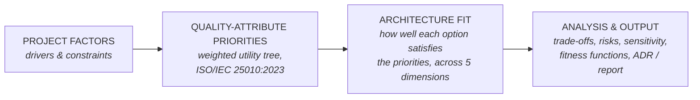
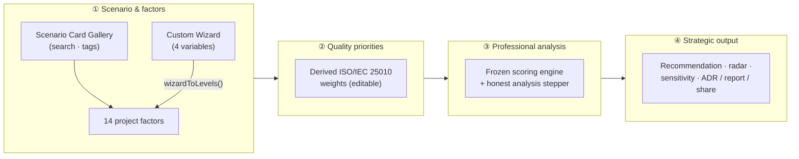
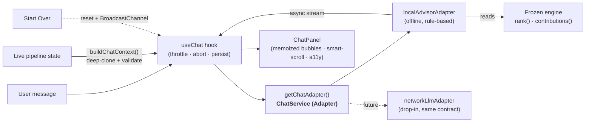
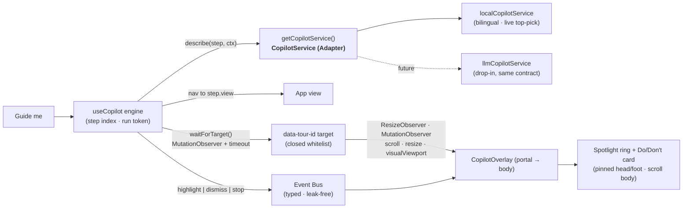

# Architecture Advisor

> A transparent, quality-attribute-driven decision-support tool for choosing software architecture — and always explaining *why*.

[](https://programmershinobi.github.io/architecture-advisor/)
[](#run-it-locally)
[](.github/workflows/ci.yml)
[](docs/)
[](LICENSE)
[](LICENSE-docs.md)

---

## What is this?

Choosing how to build a system — the deployment model, how services talk, how data is
managed — is decided early, hard to reverse, and disproportionately shapes the system's
quality. In practice these decisions are too often made by trend rather than by an explicit
trade-off analysis.

**Architecture Advisor** is a fully client-side web app that turns that decision into a
transparent pipeline:



You answer a handful of questions about your project; the tool recommends an architecture
across five dimensions, ranks the alternatives, and — critically — **shows the full
calculation**: which factor raised which quality attribute, and how that produced the score.
Experts get auditable numbers and editable weights; newcomers get plain-language explanations.

**Two ways in.** Start from a **Scenario Card Gallery** — searchable, tag-filterable cards for
ten pre-built scenarios (startup MVP, regulated fintech, high-traffic e-commerce, IoT streaming,
legacy modernization, …) — or open the **Custom Architecture Wizard** (the dominant dashed
"Build custom system" card): a foolproof guided builder that captures four universal variables
(Primary System Goal · Domain/Industry · Hard Constraints · prioritized NFRs) and maps them onto
the **same frozen scoring engine** — there is exactly one scoring model, never a parallel one.
Running a scenario briefly surfaces the engine's **real** analysis stages as a developer terminal
readout (weights → score 21 options → anti-patterns → rank), then reveals the result — no fake
latency, and instant under `prefers-reduced-motion`.

It adapts established methods — **ISO/IEC 25010:2023**, **ATAM**, **Attribute-Driven Design**,
and **evolutionary-architecture fitness functions** — into an interactive tool, and is honest
about uncertainty: scores are *tunable heuristics, not facts*.

The built-in **Guide** (the “Panduan / Guide” button) is a genuine deep-dive: alongside the full
scoring walkthrough it now **explains every architecture the Advisor evaluates** (all five
decisions) in plain language for newcomers **and** experts — *What / When it fits / What it costs /
Deeper* per option — backed by a cited bibliography (Bass, Newman, Kleppmann, Fowler, Richards &
Ford, SEI, and peer-reviewed surveys). Canonical source:
[`docs/03-blueprint/architecture-reader.md`](docs/03-blueprint/architecture-reader.md).

An **Insights** area (top nav: *Home · Advisor · Insights*) covers **every architecture the Advisor
evaluates** through four lenses — **Catalog** (discover it), **Playbook** (implement it, step by
step), **Review** (evaluate it: pros/cons, performance, scalability, DX, verdict), and **Library**
(reference: definition, concepts, patterns, terminology) — data-driven from the frozen model, so
coverage can never be partial or drift (a unit test asserts 21×4 parity). Each architecture carries
several cited, trusted references (books + peer-reviewed journals); no content is duplicated across
lenses — a per-page lens nav walks the Catalog → Playbook → Review → Library knowledge journey. The
sections also list hand-authored, English-first Markdown guides under [`content/`](content/), each
bound to the model and gated by `content:validate`. Three more sections build **on top of** the
lenses: **Roadmap** (guided learning paths), **Academy** (client-side quiz modules that link back to
the page that teaches each answer), and **Lab** (hypothesis experiments whose prepared scenarios
load into the live scoring engine) — each covering **all 21 architectures** too (unit-tested
parity, matching the lenses). The area is **client-rendered, lazy-loaded, and
dependency-free** (a small XSS-safe Markdown renderer); search engines get a build-time **SEO
layer** (sitemap, robots, JSON-LD, static crawlable article snapshots) without any SSG/router —
see the [content rollout plan](docs/03-blueprint/content-rollout-plan.md).

## Project status

> **v1.0 MVP implemented.** The repository holds both the full specification/design set **and** the
> implemented, client-side application (Vite + React + TypeScript). It covers the four-step flow
> across all five dimensions — factors → priorities → recommendation → export — with the trade-off
> radar, anti-pattern detection, sensitivity & migration paths, fitness functions, guided/expert
> modes, EN/ID, dark mode, and ADR / report / CSV / JSON / share exports. The scoring engine is a
> TypeScript twin of the verified model ([`scripts/verify-model.mjs`](scripts/verify-model.mjs)).
> See the
> [evolution roadmap](docs/01-discovery-and-planning/discovery-and-planning.md#15-versioning-policy--evolution-roadmap)
> for what's deferred beyond v1.0.

## Workflow — the immutable four-step journey

Every scenario flows through the same four steps; **Step 3 is the engine** (the "professional
analysis"). The flow never changes — only the inputs do.



- **① Scenario & factors** — pick a preset card, build a custom system with the wizard, or set the
  14 factors directly. The wizard and presets both resolve to the same 14 factor levels.
- **② Quality priorities** — the engine derives the twelve ISO/IEC 25010 quality-attribute weights;
  experts can pin/override any weight (the rest re-balance around it).
- **③ Professional analysis** — the frozen engine scores all 21 architectures across the five
  dimensions. A brief, skippable terminal stepper surfaces the real pipeline stages, then the
  ranked result appears. **Live factor edits recompute instantly** (no stepper).
- **④ Strategic output** — the recommendation with a trade-off radar, sensitivity, anti-pattern
  warnings and migration paths; export an ADR (MADR), a full report, CSV/JSON, or a share link.

## AI Advisor chat (Phase 3)

> **Status: temporarily disabled.** The chat is gated **off** behind a single flag
> (`FEATURES.chat` in [`src/config/features.ts`](src/config/features.ts)) while its UX is being
> finalized, so the deployed build ships without it. The code is complete and code-split; flip the
> flag to `true` to bring it back (the FAB mounts, "Start Over" resets it, and the Copilot tour
> restores its chat step — no other change). The rest of this section describes it as designed.

A floating **AI Advisor** (bottom-right) answers questions grounded in *your* scenario —
"what do you recommend?", "what is microservices?", "monolith vs microservices", "why?". It is a
**client-side, offline, rule-based** assistant computed from the frozen engine + the same config
the app renders, so it can never contradict the model or fabricate a fact (the UI says
*"computed from the model, not a language model"*). It is built on the **Adapter Pattern**, so a
network LLM is a drop-in later with zero UI changes.



- **Zero-Mismatch handoff** — `buildChatContext()` deep-clones (`structuredClone`) the pipeline
  payload, so the chat can never mutate the app's scenario; invalid input degrades to a moderate
  baseline (no `undefined`/crash).
- **No spam, clean cancel** — submissions are throttled and ignored while streaming; every turn
  streams under an `AbortSignal` (stop / regenerate / unmount all cancel cleanly).
- **Anti-contamination** — "Start Over" wipes chat state + persistence and broadcasts a reset so
  other tabs clear silently. The launcher is mounted **globally**, so switching tabs closes the
  Guide but never disrupts an active chat stream.
- **Lean & safe** — the launcher **and** everything behind it are lazy-loaded (initial JS budget
  untouched); bubbles render with the dependency-free, XSS-safe-by-construction Markdown renderer
  (React elements, never `dangerouslySetInnerHTML`), each wrapped in a per-bubble error boundary.

## Interactive Copilot & guided tour (Phase 3)

A **"Guide me" launcher** (bottom-right, Advisor tab) starts a step-by-step walkthrough of the
four-step journey. Each step **navigates to the right view, scrolls its target into the upper
third, and rings it with a spotlight** while a card explains what the step does — with concrete
**Do / Don't** guidance. Like the chat, it is **100% client-side, offline, and dependency-free**:
no external tour library, no `dangerouslySetInnerHTML`, and targets are addressed through a
**closed `data-tour-id` whitelist** (a command can never point the overlay at an arbitrary
selector). It ships as a **pluggable `src/features/copilot/` module** behind a service adapter, so
a smarter (even LLM-driven) guide is a drop-in later with zero UI changes.



- **Goes to the location, never covers it** — a Pre-Flight Check scrolls the target to the upper
  third and waits a paint before the first draw; the ring then tracks it live via
  `ResizeObserver` + `MutationObserver` + `scroll`/`resize`/`visualViewport`. On phones the card is
  a **bottom sheet** (pinned header/footer, only the body scrolls) so a full step — title, body,
  **and** both Do/Don't cards — is always readable and **never clipped**.
- **Safe by construction** — only whitelisted `data-tour-id`s can be highlighted; a missing target
  degrades to a **silent fallback** (card centers, "this control isn't on screen" note) instead of
  hanging or throwing. The overlay renders through a **React portal** to `document.body`, escaping
  every `z-index` stacking context (primary `z10` < utility `z20` < copilot overlay `z9999`).
- **Nav-harmony & clean teardown** — switching tabs mid-tour stops it; "Start Over" resets the tour
  alongside the chat; every observer/listener/timer is cleaned up (zero leaks). The launcher and
  the whole overlay are **lazy-loaded**, so the initial JS budget is untouched.

## Run it locally

> **Prerequisite:** Node **24** (LTS) — the version is pinned in [`.nvmrc`](.nvmrc) and used by all
> CI workflows (`node-version-file`), so local and CI always match.

```bash
npm install
npm run dev      # start the dev server (fully client-side)
npm run test     # unit + component + a11y tests (engine, exporters, UI, axe)
npm run lint     # ESLint (strict)
npm run build    # production build (static; deploys to GitHub Pages)
```

`npm install && npm run dev` is all you need. To tailor the model see **[EXTENDING.md](EXTENDING.md)**;
for the build-time choices see **[DECISIONS.md](DECISIONS.md)**.

## Documentation

The project is organized along the **software development lifecycle (SDLC)** — one numbered
folder per phase, each with a concrete deliverable — so the flow of work is explicit and
traceable:

| # | Phase | Output | Status |
|---|-------|--------|--------|
| 1 | [Discovery & Planning](docs/01-discovery-and-planning/discovery-and-planning.md) | Project charter / product vision | ✅ Complete |
| 2 | [Requirement Analysis](docs/02-requirement-analysis/) | [SRS](docs/02-requirement-analysis/software-requirements-specification.md) | 🔬 In progress |
| 3 | [Blueprint (Design)](docs/03-blueprint/) | [Design spec](docs/03-blueprint/design-specification.md) + [Model Data Sheet](docs/03-blueprint/model-data-sheet.md) + [Architecture Reader](docs/03-blueprint/architecture-reader.md) + [Content Rollout Plan](docs/03-blueprint/content-rollout-plan.md) + [UI prototype](docs/03-blueprint/prototype/index.html) | 🔬 In progress |
| 4 | [Development](docs/04-development/) | Source code (`src/`, scoring engine, components) | ✅ v1.0 implemented |
| 5 | [Testing / QA](docs/05-testing-qa/) | [Test plan](docs/05-testing-qa/test-plan.md) — 127 Vitest + 14 Playwright E2E + 6 guards (model / docs / app-config / content / bundle-size / SEO); CI gates size/axe; 14/16 AC automated | 🔬 In progress |
| 6 | [Deployment / Release](docs/06-deployment/) | [Live on GitHub Pages](https://programmershinobi.github.io/architecture-advisor/) via `deploy.yml` (CI/CD) | ✅ Live |
| 7 | [Maintenance & Iteration](docs/07-maintenance/) | [Changelog](CHANGELOG.md), Dependabot, issue/PR templates, [security policy](SECURITY.md) | 🔄 Ongoing |

Cross-cutting references — the [Build Spec v3](docs/specs/build-spec-v3.md) and the
[execution playbooks](docs/guides/) — support multiple phases. The full map, with an SDLC flow
diagram, is in **[docs/README.md](docs/README.md)**.

## Browser support

**Recommended:** the latest two stable versions of **Chrome, Edge, Firefox, or Safari** — desktop
**and** mobile. The app is responsive down to a **360 px** viewport and is verified for WCAG AA in
both light and dark themes.

- **Baseline** (the "evergreen" verification target): ES2020 + `localStorage`. **Internet Explorer
  is not supported.**
- Older or non-conforming browsers (or with JavaScript disabled) get a **readable message
  recommending a modern browser**, not a blank page (SRS `FR-EDGE-4`).
- Automated E2E runs on Chromium (Playwright); Safari iOS / Firefox are covered by the shared
  evergreen standards — a quick manual look is advised before a release.

The canonical statement is [SRS §2.3 — Operating Environment](docs/02-requirement-analysis/software-requirements-specification.md#23-operating-environment).

## Tech stack

- **Vite + React + TypeScript** (strict), Tailwind CSS — **dark by default** (“Aurora Slate” — ADR-009), Space Grotesk + Inter + JetBrains Mono, Tabler icons
- **Hand-built SVG/CSS** visuals (trade-off radar, score bars, C4-style diagram stub) — no chart or diagram library
- React hooks only; state persisted to `localStorage` and encoded in the URL hash (shareable links)
- Lightweight i18n (ID/EN), Vitest + Testing Library, ESLint + Prettier
- **Pure client-side** — no backend, database, accounts, or AI calls
- Responsive to 360px; **WCAG AA** in both themes — names/roles/ARIA, keyboard, and color-contrast verified by axe + Playwright ([test plan](docs/05-testing-qa/test-plan.md))

## Design principles

1. **Intellectual honesty** — decision support, not an oracle. Surface uncertainty, close calls, and a permanent disclaimer.
2. **Transparency** — every score is traceable from factor → QA weight → option fit.
3. **Methodological grounding** — cite ISO/IEC 25010:2023, ATAM, ADD, fitness functions.
4. **Approachable yet deep** — guided mode for newcomers, expert mode for architects.
5. **Actionable & shareable** — export an ADR (MADR) and a full report; share via URL.
6. **Open & evolving** — community-built, improving across versions.

## Extending — scenarios, the Custom Wizard & the Step-3 UI

Everything below is **typed, injectable config** — you add data, not logic. The frozen scoring
model (`src/config/{factors,dimensions,qualityAttributes,factorQaMatrix}.ts`) is verified by
`npm run verify:model` and must not change; new *scenarios* never touch it.

### Add a preset scenario

Presets are strictly-typed `Preset[]`. Append one to [`src/config/presets.ts`](src/config/presets.ts)
and give it filter tags in [`src/config/presetTags.ts`](src/config/presetTags.ts) — the Card Gallery
picks it up automatically. Helper presets are `calibrated: false`; the five ratified ones stay
`true` and are bit-pinned by the guards.

```ts
// src/config/presets.ts
{
  id: 'edge-cdn',
  label: { en: 'Edge / CDN app', id: 'Aplikasi edge / CDN' },
  description: { en: 'Globally distributed, latency-critical, cache-heavy.', id: '…' },
  levels: levels([1, 2, 1, 1, 2, 2, 1, 1, 2, 1, 0, 1, 0, 2]), // 14 factors, values 0–2
  calibrated: false,
},

// src/config/presetTags.ts
export const PRESET_TAGS = { /* … */ 'edge-cdn': ['high-scale', 'realtime'] };
```

A unit test (`src/config/presets.test.ts`) pins each helper preset's engine outcome, so a bad
scenario fails the build rather than silently drifting.

### Add / modify a Custom Wizard question

The wizard is driven entirely by [`src/config/customWizard.ts`](src/config/customWizard.ts). Each
option declares the factor **nudges** it applies; the pure bridge
[`src/lib/customWizard.ts`](src/lib/customWizard.ts) combines them (ordered override from a moderate
baseline, hard constraints last) into the 14 factor levels the frozen engine scores. **No component
edits are needed** — `CustomWizard.tsx` iterates this config.

```ts
// src/config/customWizard.ts → add an option to the "goal" question
{
  id: 'batch-etl',
  label: { en: 'Run heavy batch / ETL', id: 'Jalankan batch / ETL berat' },
  hint:  { en: 'Scheduled data pipelines at volume', id: '…' },
  levels: { dataVolume: 2, async: 2, scale: 2, realtime: 0 }, // only real factor ids, 0–2
},
```

`wizardToLevels()` is unit-tested (`src/lib/customWizard.test.ts`): every nudge must reference a
real factor id at a valid level, and the output is always a complete, valid `Levels` object — even
when the user answers nothing (it falls back to a balanced baseline; the engine can never crash).

### Modify the Step-3 terminal UI (analysis stepper)

The developer-centric readout lives in
[`src/components/advisor/AnalysisStepper.tsx`](src/components/advisor/AnalysisStepper.tsx). The
stages are dict keys — edit the `STAGES` array and their strings in
[`src/i18n/dict.ts`](src/i18n/dict.ts) (`analysis.run.*`). Keep the stages **honest** (they name
real pipeline steps) and the total duration short; the component already renders nothing under
`prefers-reduced-motion`. It is triggered by `analysisRun` in `App.tsx`, which increments on an
explicit analyze action (preset/wizard apply) — never on a live factor edit.

### Swap the chat AI backend (ChatService adapter)

The chat depends only on the `ChatAdapter` contract, so the whole UI/state layer is backend-agnostic.
`getChatAdapter()` in [`src/lib/chat/index.ts`](src/lib/chat/index.ts) is the **single** swap-point —
return a different adapter and nothing else changes:

```ts
// src/lib/chat/types.ts (the contract every backend implements)
export interface ChatAdapter {
  readonly id: string;
  readonly network: boolean; // drives offline UX + resiliency paths
  reply(history: readonly ChatMessage[], context: ChatContext, signal: AbortSignal): AsyncIterable<ChatChunk>;
}

// src/lib/chat/index.ts — swap here, zero UI/hook changes:
export function getChatAdapter(): ChatAdapter {
  return localAdvisorAdapter;        // today: offline, rule-based, grounded in the frozen engine
  // return networkLlmAdapter;       // future: a streaming LLM — same contract, drop-in
}
```

`buildChatContext()` deep-clones + validates the pipeline payload before it reaches any adapter, so
a new backend can never mutate app state or receive an `undefined`.

### Add a Copilot step (or swap the guide backend)

The tour is data: add a step to `MAIN_TOUR` in
[`src/features/copilot/tourConfig.ts`](src/features/copilot/tourConfig.ts). `target` must be one of
the whitelisted `data-tour-id`s in [`dataTourId.ts`](src/features/copilot/dataTourId.ts) — tag the
element with the type-safe `tourId()` helper and the test suite enforces the pairing:

```ts
// 1) tag the element (closed whitelist — the only ids the overlay can point at)
<section {...tourId('recommendation')}> … </section>

// 2) add a bilingual step with concrete Do / Don't guidance
{ id: 'result', view: 'advisor', target: 'recommendation', placement: 'top',
  title: { en: 'Your recommended plan', id: 'Rencana yang disarankan' },
  body:  { en: 'Ranked per dimension…', id: 'Diperingkat per dimensi…' },
  dos:   [{ en: 'Read the "why"', id: 'Baca alasannya' }],
  donts: [{ en: 'Chase a single number', id: 'Mengejar satu angka' }] }
```

The overlay depends only on the `CopilotService` contract;
`getCopilotService()` in [`copilotService.ts`](src/features/copilot/copilotService.ts) is the
**single** swap-point — return a smarter (even LLM-driven) service and nothing else changes:

```ts
export function getCopilotService(): CopilotService {
  return localCopilotService;   // today: offline, bilingual, weaves in your live top pick
  // return llmCopilotService;  // future: a generated walkthrough — same contract, drop-in
}
```

### Component map (Advisor tab)

| Area | Component | Notes |
|---|---|---|
| Scenario gallery + wizard entry | [`components/advisor/PresetBar.tsx`](src/components/advisor/PresetBar.tsx) | search, tag filters, dominant custom card |
| AI Advisor chat (lazy, flag-gated) | [`components/chat/ChatFab.tsx`](src/components/chat/ChatFab.tsx) · `ChatPanel.tsx` · [`hooks/useChat.ts`](src/hooks/useChat.ts) | launcher + panel + state bridge — off via `FEATURES.chat` |
| Chat service (Adapter) | [`lib/chat/`](src/lib/chat/) | `getChatAdapter()` · `localAdvisorAdapter` · `buildChatContext()` |
| Copilot tour (lazy, pluggable) | [`features/copilot/Copilot.tsx`](src/features/copilot/Copilot.tsx) · `useCopilot.ts` · `components/CopilotOverlay.tsx` | launcher + engine + portal overlay |
| Copilot service (Adapter) | [`features/copilot/`](src/features/copilot/) | `getCopilotService()` · `MAIN_TOUR` · `tourId()` whitelist · event bus |
| Custom wizard (lazy modal) | [`components/advisor/CustomWizard.tsx`](src/components/advisor/CustomWizard.tsx) | iterates the wizard config |
| Wizard → engine bridge (pure) | [`lib/customWizard.ts`](src/lib/customWizard.ts) | `wizardToLevels()` — the only mapping |
| ① Project factors | [`components/advisor/FactorInputs.tsx`](src/components/advisor/FactorInputs.tsx) · `FactorField.tsx` | 14 factors, per-level examples |
| ② Quality priorities + adjuster | [`components/advisor/PrioritiesCard.tsx`](src/components/advisor/PrioritiesCard.tsx) · `QaOverridePanel.tsx` | derived + editable weights |
| ③ Analysis stepper | [`components/advisor/AnalysisStepper.tsx`](src/components/advisor/AnalysisStepper.tsx) | honest terminal readout |
| ③ Recommendation | `DimensionCards.tsx` · `DimensionDetail.tsx` · `RadarPanel.tsx` | ranked result + radar |
| ④ Export / share | [`components/chrome/Toolbar.tsx`](src/components/chrome/Toolbar.tsx) | ADR / report / CSV / JSON / share |
| Pure scoring engine (frozen) | [`lib/scoring.ts`](src/lib/scoring.ts) | `rank()` — the single source of truth |

## Contributing

Contributions are welcome — code, documentation, translations, and model review. Start with
[CONTRIBUTING.md](CONTRIBUTING.md) and the [Code of Conduct](CODE_OF_CONDUCT.md). Governance,
roles, and the contribution flow are described in Section 14 of the
[discovery charter](docs/01-discovery-and-planning/discovery-and-planning.md#14-governance--contribution).

## License

- **Code:** [MIT](LICENSE)
- **Documentation & content:** [CC BY 4.0](LICENSE-docs.md)

## Author

**Faqih Pratama Muhti**, B.Sc. Computer Science — *Product Owner, Maintainer.*
