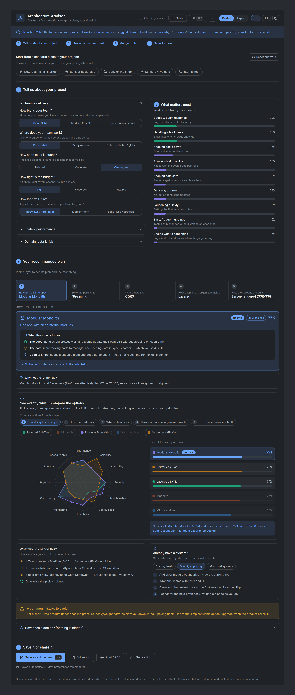
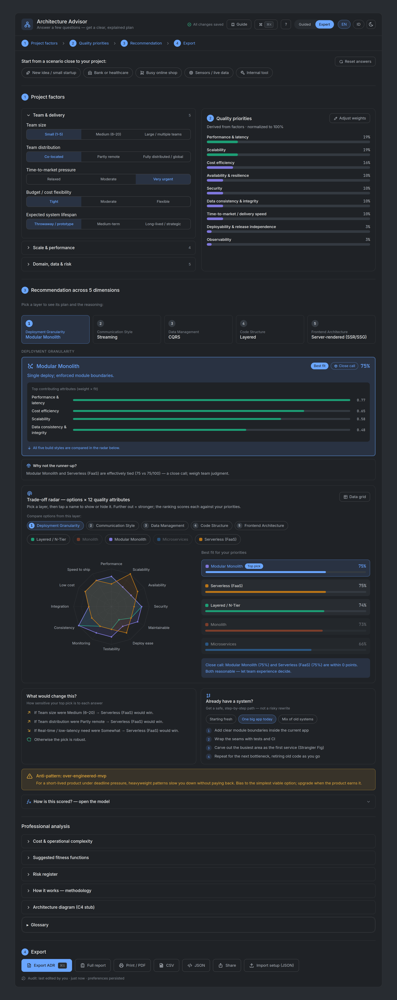

# Architecture Advisor

> A transparent, quality-attribute-driven decision-support tool for choosing software architecture — and always explaining *why*.

[](#run-it-locally)
[](.github/workflows/ci.yml)
[](docs/)
[](LICENSE)
[](LICENSE-docs.md)

---

## Preview

The **same project, two audiences.** *Guided* mode gives newcomers plain-language explanations
("Speed & quick response", a "what this means for you" narrative); *Expert* mode gives architects
the technical attribute names, editable weights, per-attribute contribution bars, and a
**Professional analysis** section (cost & ops, fitness functions, risk register, methodology, a C4
stub, glossary). Both run from the same engine — toggle with one click. Run it with `npm run dev`.

<table>
  <tr>
    <th align="center" width="50%">Guided mode (newcomers)</th>
    <th align="center" width="50%">Expert mode (architects)</th>
  </tr>
  <tr valign="top">
    <td width="50%"><a href="docs/03-blueprint/prototype/index.html"></a></td>
    <td width="50%"><a href="docs/03-blueprint/prototype/index.html"></a></td>
  </tr>
</table>

> Prefer no build step? Open the static [UI prototype](docs/03-blueprint/prototype/index.html) — it
> mirrors the app and opens in Expert mode (switch to Guided with the header toggle).

---

## What is this?

Choosing how to build a system — the deployment model, how services talk, how data is
managed — is decided early, hard to reverse, and disproportionately shapes the system's
quality. In practice these decisions are too often made by trend rather than by an explicit
trade-off analysis.

**Architecture Advisor** is a planned, fully client-side web app that turns that decision into
a transparent pipeline:

```
PROJECT FACTORS  ─►  QUALITY-ATTRIBUTE PRIORITIES  ─►  ARCHITECTURE FIT  ─►  ANALYSIS
(drivers &           (a weighted "utility tree" of      (how well each option   (trade-offs, risks,
 constraints)         quality attributes, grounded       satisfies the           sensitivity, fitness
                      in ISO/IEC 25010:2023)             prioritized QAs across   functions, ADR/report)
                                                         5 orthogonal dimensions)
```

You answer a handful of questions about your project; the tool recommends an architecture
across five dimensions, ranks the alternatives, and — critically — **shows the full
calculation**: which factor raised which quality attribute, and how that produced the score.
Experts get auditable numbers and editable weights; newcomers get plain-language explanations.

It adapts established methods — **ISO/IEC 25010:2023**, **ATAM**, **Attribute-Driven Design**,
and **evolutionary-architecture fitness functions** — into an interactive tool, and is honest
about uncertainty: scores are *tunable heuristics, not facts*.

## Project status

> **v1.0 MVP implemented.** The repository holds both the full specification/design set **and** the
> implemented, client-side application (Vite + React + TypeScript). It covers the four-step flow
> across all five dimensions — factors → priorities → recommendation → export — with the trade-off
> radar, anti-pattern detection, sensitivity & migration paths, fitness functions, guided/expert
> modes, EN/ID, dark mode, and ADR / report / CSV / JSON / share exports. The scoring engine is a
> TypeScript twin of the verified model ([`scripts/verify-model.mjs`](scripts/verify-model.mjs)).
> See the
> [evolution roadmap](docs/01-discovery-and-planning/discovery-and-planning.md#15-versioning-policy--evolution-roadmap)
> for what's deferred beyond v1.0.

## Run it locally

```bash
npm install
npm run dev      # start the dev server (fully client-side)
npm run test     # scoring-engine + exporter unit tests
npm run lint     # ESLint (strict)
npm run build    # production build (static; deploys to GitHub Pages)
```

`npm install && npm run dev` is all you need. To tailor the model see **[EXTENDING.md](EXTENDING.md)**;
for the build-time choices see **[DECISIONS.md](DECISIONS.md)**.

## Documentation

The project is organized along the **software development lifecycle (SDLC)** — one numbered
folder per phase, each with a concrete deliverable — so the flow of work is explicit and
traceable:

| # | Phase | Output | Status |
|---|-------|--------|--------|
| 1 | [Discovery & Planning](docs/01-discovery-and-planning/discovery-and-planning.md) | Project charter / product vision | ✅ Complete |
| 2 | [Requirement Analysis](docs/02-requirement-analysis/) | [SRS](docs/02-requirement-analysis/software-requirements-specification.md) | 🔬 In progress |
| 3 | [Blueprint (Design)](docs/03-blueprint/) | [Design spec](docs/03-blueprint/design-specification.md) + [Model Data Sheet](docs/03-blueprint/model-data-sheet.md) + [UI prototype](docs/03-blueprint/prototype/index.html) | 🔬 In progress |
| 4 | [Development](docs/04-development/) | Source code (`src/`, scoring engine, components) | ✅ v1.0 implemented |
| 5 | [Testing / QA](docs/05-testing-qa/) | [Test plan](docs/05-testing-qa/test-plan.md) — 62 Vitest + Playwright E2E + 3 guards; CI gates size/audit; 14/16 AC automated | 🔬 In progress |
| 6 | [Deployment / Release](docs/06-deployment/) | CI/CD → staging → live ([guide ready](docs/06-deployment/deployment-github-pages.md)) | 🚧 Not started |
| 7 | [Maintenance & Iteration](docs/07-maintenance/) | Monitoring, fixes, updates | 🚧 Ongoing |

Cross-cutting references — the [Build Spec v3](docs/specs/build-spec-v3.md) and the
[execution playbooks](docs/guides/) — support multiple phases. The full map, with an SDLC flow
diagram, is in **[docs/README.md](docs/README.md)**.

## Tech stack

- **Vite + React + TypeScript** (strict), Tailwind CSS — **dark by default**, Inter + JetBrains Mono, Tabler icons
- **Hand-built SVG/CSS** visuals (trade-off radar, score bars, C4-style diagram stub) — no chart or diagram library
- React hooks only; state persisted to `localStorage` and encoded in the URL hash (shareable links)
- Lightweight i18n (ID/EN), Vitest + Testing Library, ESLint + Prettier
- **Pure client-side** — no backend, database, accounts, or AI calls
- Responsive to 360px, keyboard-accessible (axe + Playwright verified); targets WCAG AA — de-emphasised muted-text contrast is under remediation ([test plan](docs/05-testing-qa/test-plan.md))

## Design principles

1. **Intellectual honesty** — decision support, not an oracle. Surface uncertainty, close calls, and a permanent disclaimer.
2. **Transparency** — every score is traceable from factor → QA weight → option fit.
3. **Methodological grounding** — cite ISO/IEC 25010:2023, ATAM, ADD, fitness functions.
4. **Approachable yet deep** — guided mode for newcomers, expert mode for architects.
5. **Actionable & shareable** — export an ADR (MADR) and a full report; share via URL.
6. **Open & evolving** — community-built, improving across versions.

## Contributing

Contributions are welcome — code, documentation, translations, and model review. Start with
[CONTRIBUTING.md](CONTRIBUTING.md) and the [Code of Conduct](CODE_OF_CONDUCT.md). Governance,
roles, and the contribution flow are described in Section 14 of the
[discovery charter](docs/01-discovery-and-planning/discovery-and-planning.md#14-governance--contribution).

## License

- **Code:** [MIT](LICENSE)
- **Documentation & content:** [CC BY 4.0](LICENSE-docs.md)

## Author

**Faqih Pratama Muhti**, B.Sc. Computer Science — *Product Owner, Maintainer.*
