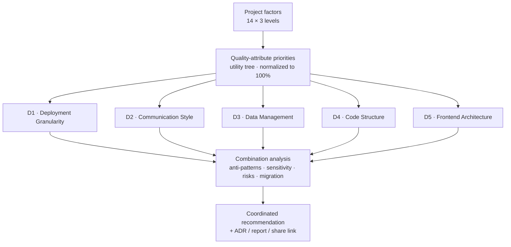

# Architecture Advisor — Software Requirements Specification (SRS)

**Requirement Analysis Phase · Software Requirements Specification**

| Field | Detail |
|---|---|
| **Document type** | Software Requirements Specification (SRS) |
| **Version** | 1.2 |
| **Date** | 2026-07-03 |
| **Status** | Baseline — v1.0 implemented |
| **Author / Owner** | Faqih Pratama Muhti, B.Sc. Computer Science |
| **Audience** | Engineers, architects, analysts, reviewers |
| **Derived from** | [Discovery & Planning charter](../01-discovery-and-planning/discovery-and-planning.md) v1.8 · [Build Spec v3](../specs/build-spec-v3.md) |
| **License** | [CC BY 4.0](../../LICENSE-docs.md) |

**Document history**

| Version | Date | Summary |
|---|---|---|
| 0.1 | 2026-06-10 | Initial SRS draft derived from the charter and Build Spec v3 |
| 0.2 | 2026-06-11 | Maturity pass: a verification method on every functional requirement; completed definitions; explicit non-goals (Section 2.6); edge-case, resilience & input-validation requirements (Section 3.8); quantified performance budgets and a browser-support baseline; open issues given target milestones |
| 0.3 | 2026-06-12 | Build-readiness: pinned the factor count at 14 (closes OI-1); linked the new [Model Data Sheet](../03-blueprint/model-data-sheet.md) that freezes all numeric model values; OI-2/OI-4 now reference recorded baselines |
| 0.4 | 2026-06-12 | Computation precision: linked the [Scoring Algorithm Specification](../03-blueprint/scoring-algorithm.md); pinned defaults exactly (budget = 2, the no-signal level of the inverted factor) in FR-FACT-5/AC-2; AC-2/AC-3 now state exact expected composites and the expected close-call flag; Section 5.3 presets machine-verified, IoT D5 target widened to SPA / SSR |
| 0.5 | 2026-06-12 | Reference hardening: added peer-reviewed and standard sources (SUS and its acceptability threshold, MADR, Strangler Fig, additive multi-attribute value model, ADD technical report) and cited them inline at NFR-USE-1, FR-OUT-1, FR-REC-12/13, and Section 5.1 |
| 0.6 | 2026-06-13 | Calibration-stability review: widened the e-commerce and IoT D4 targets to Hexagonal / Clean (the pair differs only on interoperability and ties exactly whenever that weight is 0); margins for every preset target are now machine-measured (Scoring Algorithm Section 9.4) |
| 0.7 | 2026-06-13 | Closed OI-2 and OI-4: the preset calibration and the D4/D5 `qaFit` vectors are interim-ratified ([ADR-0002](../adr/0002-ratify-preset-calibration.md), [ADR-0001](../adr/0001-ratify-d4-d5-qafit.md)) |
| 0.8 | 2026-06-13 | Closed OI-3: a basic C4-style stub is in v1.0 (FR-OUT-5, Could); richer auto-generated C4 deferred to v2.x. Charter pointer → v1.7 |
| 0.9 | 2026-06-13 | Performance-budget targets ratified (NFR-PERF-3, design ADR-008): numbers committed with mandatory lazy-loading of mermaid/recharts; OI-5 target-setting closed, real-bundle measurement remains a Phase 4/5 verification step |
| 1.0 | 2026-06-16 | v1.0 implemented. Added the v1.1 enhancement requirements realized in the app — FR-SHELL-9 (in-app Manual with a live worked calculation), FR-REC-14 (runner-up explainer), FR-REC-15 (A/B scenario comparison), FR-OUT-7 (Print/PDF). Reconciled the chart technology to hand-built SVG (`recharts` dropped — NFR-PERF-3, AC-12, Section 2.4; see [DECISIONS.md](../../DECISIONS.md)). Charter pointer → v1.8 |
| 1.1 | 2026-06-16 | UI/UX polish: the **C4 stub is now hand-built SVG** (`mermaid` dropped — it failed to render; FR-OUT-5, NFR-PERF-3, AC-12, Section 2.4); project factors and the expert analysis panels use **collapsible dropdowns**; the expert QA-weight override panel UI fixed; exports gained a **plain-language executive summary** (report/ADR/print). No requirements removed |
| 1.2 | 2026-07-03 | v1.1 enhancements: added **architecture explanations in the Manual/Guide** (Section 3.9, FR-READ-1..5) and the **Insights content area** (Section 3.10, FR-LEARN-1..7 + FR-SHELL-10) — Catalog/Playbook/Review cover every architecture, data-driven from the frozen model, dual-audience (Guided/Expert), client-rendered & lazy-loaded (SSG deferred). See the [content rollout plan](../03-blueprint/content-rollout-plan.md) and [DECISIONS.md](../../DECISIONS.md). No requirements removed |
| 1.3 | 2026-07-06 | **Insights holistic coverage + English-first**: FR-LEARN-6 extended to all four sections (Catalog/Playbook/Review/Library) with distinct structured lenses and a per-page lens navigation (the Catalog → Playbook → Review → Library knowledge journey) for every one of the 21 architectures; FR-SHELL-2 default language flipped to **EN** (toggle unchanged); FR-LEARN-2 content gate now requires **at least the `en` version**. See [DECISIONS.md](../../DECISIONS.md). No requirements removed |
| 1.4 | 2026-07-06 | **Insights Wave C + SEO**: added FR-LEARN-8 (Roadmap — guided learning paths), FR-LEARN-9 (Academy — client-side quiz modules), FR-LEARN-10 (Lab — hypothesis experiments that load prepared scenarios into the live engine), and FR-SEO-1 (build-time sitemap/robots/JSON-LD + static crawlable article snapshots; SSG-lite — the SPA architecture is unchanged, superseding "SSG deferred" for discoverability). §3.10 updated to seven sections. No requirements removed |

---

## Table of Contents

- [1. Introduction](#1-introduction)
- [2. Overall Description](#2-overall-description)
- [3. Functional Requirements](#3-functional-requirements)
- [4. Non-Functional Requirements](#4-non-functional-requirements)
- [5. Data & Decision-Model Requirements](#5-data--decision-model-requirements)
- [6. Use Cases](#6-use-cases)
- [7. Acceptance Criteria](#7-acceptance-criteria)
- [8. Requirements Traceability Matrix](#8-requirements-traceability-matrix)
- [9. Open Issues & To Be Determined](#9-open-issues--to-be-determined)

---

## 1. Introduction

### 1.1 Purpose

This document specifies the functional and non-functional requirements for **Architecture
Advisor v1.0 (MVP)**. It translates the approved [Discovery & Planning charter](../01-discovery-and-planning/discovery-and-planning.md)
and the [Build Spec v3](../specs/build-spec-v3.md) into discrete, testable, traceable
requirements that guide design (Phase 3), implementation (Phase 4), and verification (Phase 5).

The structure follows ISO/IEC/IEEE 29148:2018. Where the Build Spec already defines model
internals (factor values, fit vectors, rule conditions), this SRS references them rather than
restating them, and instead specifies *what the system must do* and *how well*.

### 1.2 Product Scope

Architecture Advisor is a **client-side web application** that turns project factors into a
transparent, quality-attribute-driven architecture recommendation across five dimensions, with
trade-off, sensitivity, risk, anti-pattern, and fitness-function analysis, and exportable
decision records. The authoritative scope (in/deferred/non-goals) is the charter,
[Section 5 Scope](../01-discovery-and-planning/discovery-and-planning.md#5-scope); this SRS covers the
**in-MVP** scope only. Deferred items are out of scope for these requirements.

### 1.3 Definitions & Abbreviations

| Term | Meaning |
|---|---|
| QA | Quality attribute (e.g. scalability, maintainability) per ISO/IEC 25010:2023 |
| Factor | A user-facing project driver/constraint with 3 ordinal levels (0–2) |
| Fit (`qaFit`) | An option's rated suitability (1–5) for a given QA |
| Composite score | Σ over QAs of `normalizedWeight/100 × qaFit` for an option |
| Dimension | An orthogonal architecture decision axis (D1–D5) |
| ADR | Architecture Decision Record (exported in MADR — Markdown ADR — format) |
| ATAM | Architecture Tradeoff Analysis Method |
| Utility tree | The normalized, weighted set of QA priorities |
| MoSCoW | Prioritization: Must / Should / Could / Won't (this release) |
| SUS | System Usability Scale |
| i18n / a11y | Internationalization / accessibility |
| MVP | Minimum Viable Product (the v1.0 scope) |
| MADR | Markdown Architecture Decision Record (the ADR export format) |
| SPA / SSR | Single-page application / server-side rendering (D5 options) |
| CQRS | Command Query Responsibility Segregation (a D3 option) |
| C4 | A model for visualizing software architecture (Context/Container/Component/Code) |
| SPA shell / static site | A single HTML/JS/CSS bundle served from static hosting, no backend |
| CSP | Content Security Policy (an HTTP response header that restricts content sources) |
| SemVer | Semantic Versioning (`MAJOR.MINOR.PATCH`) |
| PII | Personally Identifiable Information |
| p95 / p99 | The 95th / 99th-percentile value of a measured distribution (e.g. interaction latency) |
| Verification method | How a requirement is checked: **T** test, **D** demonstration, **I** inspection, **A** analysis |

### 1.4 References

1. [Discovery & Planning charter](../01-discovery-and-planning/discovery-and-planning.md) (v1.7) — problem, scope, KPIs, risks, governance.
2. [Build Spec v3](../specs/build-spec-v3.md) — technical specification and model definitions.
3. [UI/UX Execution Playbook](../guides/uiux-execution-playbook.md) — usability requirements for technical users.
4. ISO/IEC/IEEE 29148:2018 — Requirements engineering.
5. ISO/IEC 25010:2023 — Product quality model.
6. W3C WCAG 2.2 — Web Content Accessibility Guidelines.
7. [Model Data Sheet](../03-blueprint/model-data-sheet.md) — the frozen numeric model values (QAs, factors, matrix, D1–D5 `qaFit`, anti-patterns, presets).
8. [Scoring Algorithm Specification](../03-blueprint/scoring-algorithm.md) — the exact computation rules (formulas, tie-breaking, rounding, sensitivity) with machine-verified fixtures ([`scripts/verify-model.mjs`](../../scripts/verify-model.mjs)).
9. J. Brooke, "SUS: A 'quick and dirty' usability scale," in *Usability Evaluation in Industry*, P. W. Jordan et al., Eds. London: Taylor & Francis, 1996, pp. 189–194.
10. A. Bangor, P. T. Kortum, and J. T. Miller, "Determining what individual SUS scores mean: Adding an adjective rating scale," *Journal of Usability Studies*, vol. 4, no. 3, pp. 114–123, 2009.
11. *MADR — Markdown Architectural Decision Records*, adr.github.io/madr. [Online].
12. M. Fowler, "Strangler Fig Application," martinfowler.com, 2004. [Online].
13. R. L. Keeney and H. Raiffa, *Decisions with Multiple Objectives: Preferences and Value Tradeoffs*. New York: Wiley, 1976.
14. R. Wojcik et al., "Attribute-Driven Design (ADD), Version 2.0," SEI, Carnegie Mellon Univ., Tech. Rep. CMU/SEI-2006-TR-023, 2006.
15. [Formal Model Formulation](../03-blueprint/model-formulation.md) — the decision model as peer-reviewable mathematics (MAVT additive value model), with properties and MCDA literature grounding.

### 1.5 Requirement Conventions

- Each requirement has a unique ID (`FR-*` functional, `NFR-*` non-functional), a single
  **shall** statement, a **priority** (MoSCoW), and a **trace** to its source.
- Trace shortcuts: **Charter Section n** = a section of the charter; **Build Spec Section n** =
  a section of Build Spec v3; **UI/UX Playbook Task n** = a task in the UI/UX Execution Playbook.
- Priority for v1.0: **Must** unless stated. **Could** items may slip without affecting the MVP.
- Verification methods (Phase 5): **T** test, **D** demonstration, **I** inspection, **A** analysis.
- Every requirement carries an explicit **Verify** column so nothing ships unverifiable.

### 1.6 Requirement Quality & Change Control

To keep this specification dependable as the project evolves:

- **Atomic & verifiable.** Each requirement states a single, testable behavior. Where a
  requirement names several coordinated steps (e.g. derive → clamp → normalize), they are one
  indivisible behavior verified together, not separate requirements.
- **Conflict resolution.** If two requirements appear to conflict, the **charter** wins over this
  SRS, and this SRS wins over the Build Spec; the conflict is then logged in Section 9 and
  resolved by the Owner. The Build Spec remains authoritative only for *model internals* (factor
  values, fit vectors, rule conditions).
- **Change control.** Adding, removing, or changing the intent of a requirement bumps this
  document's version and adds a Document History row. Changes that alter the decision model
  additionally require a Domain-Advisor review and an ADR (Charter Section 14.4).
- **Stable identifiers.** Requirement IDs are permanent. A retired requirement keeps its ID and is
  marked withdrawn rather than reused, so traceability never breaks.

---

## 2. Overall Description

### 2.1 Product Perspective

A self-contained single-page application with **no backend, database, accounts, or AI calls**.
All computation is local arithmetic over small in-memory matrices. State lives in the browser
(`localStorage`) and, when shared, in the URL hash. The app is deployable as a static site
(e.g. GitHub Pages). See [Build Spec v3 Section 2](../specs/build-spec-v3.md).

### 2.2 User Classes & Characteristics

Per charter [Section 7 User Personas](../01-discovery-and-planning/discovery-and-planning.md#7-user-personas):
**P1** architect/senior engineer (Expert mode, keyboard-first, auditable math); **P2** systems
analyst (traceability, export); **P3** mid-level/newcomer (Guided mode, plain language); **P4**
non-technical decision-maker (summaries/reports); **P5** contributor (onboarding, config).

### 2.3 Operating Environment

Modern evergreen desktop and mobile browsers; responsive down to a 360 px viewport; functions
fully offline after first load; WCAG 2.2 AA in both light and dark themes.

**Supported-browser baseline** (the verification target for "evergreen"): the latest two stable
versions of Chrome, Edge, Firefox, and Safari (desktop and mobile), covering ES2020 and
`localStorage`. Internet Explorer is **not supported**. Older or non-conforming browsers receive a
plain, readable degraded experience rather than a blank page (see FR-EDGE-4).

### 2.4 Constraints

Client-side only; bilingual ID/EN; all model values held in configuration (not hard-coded);
tech stack fixed by [Build Spec v3 Section 2](../specs/build-spec-v3.md) (Vite + React + TypeScript,
Tailwind). All charts (trade-off radar, bar charts) **and the C4 diagram** are **hand-built
SVG/CSS** — `recharts` and `mermaid` were dropped in implementation (see
[DECISIONS.md](../../DECISIONS.md)). See charter
[Section 9](../01-discovery-and-planning/discovery-and-planning.md#9-assumptions-constraints--dependencies).

### 2.5 Assumptions & Dependencies

The `fit`/weight values are tunable expert heuristics (not validated facts); npm ecosystem and
free static hosting/CI are available. Full list: charter
[Section 9](../01-discovery-and-planning/discovery-and-planning.md#9-assumptions-constraints--dependencies).

### 2.6 Out of Scope / Non-Goals

Stated explicitly so these never re-enter as implicit requirements. The system **shall not**, in
v1.0:

- **Replace human judgment** or perform a full ATAM workshop — it is decision *support* only (Charter Section 21).
- **Generate application code or Infrastructure-as-Code** — the C4 diagram stub (FR-OUT-5) is a diagram, not runnable artifacts (Charter Section 5).
- **Store sensitive data, accounts, or any server-side state** — there is no backend, database, or login (Charter Section 17).
- **Make network or AI calls** to score, recommend, or explain — all computation is local arithmetic (Build Spec Section 2).
- **Claim empirical validity** for its heuristics — the validation study is deferred (Charter Section 11; OI-6).
- **Implement deferred features**: multi-stakeholder collaboration, saved multi-project comparison, **organization-level** config import/export, and generated production diagrams remain post-MVP (Charter Section 15.6). The **basic** per-user config JSON import/export (FR-OUT-6) *is* in the MVP.

---

## 3. Functional Requirements

### 3.1 Application Shell, Modes & Global UX

| ID | The system shall… | Priority | Trace | Verify |
|---|---|---|---|---|
| FR-SHELL-1 | Provide two modes — **Guided** (plain language) and **Expert** (technical terms, editable weights) — switchable at runtime, with the choice persisted. | Must | Charter Section 7; Build Spec Section 12 | T |
| FR-SHELL-2 | Provide an **ID/EN language toggle** that localizes every visible string at runtime (default **EN** — English-consistent experience, decision 2026-07; the toggle remains fully functional). | Must | Charter Section 5; Build Spec Section 2 | T |
| FR-SHELL-3 | Provide a **dark/light theme toggle**, both meeting WCAG AA contrast. | Must | Charter Section 5, Section 11 | T |
| FR-SHELL-4 | Display a **permanent, visible disclaimer** that scores are tunable heuristics, not facts. | Must | Charter Section 21 (R2) | I |
| FR-SHELL-5 | Offer **scenario presets** (startup MVP, regulated/enterprise, high-traffic e-commerce, IoT/streaming, internal tool) that populate all factors. | Must | Build Spec Section 12; Charter Section 5 | T |
| FR-SHELL-6 | Provide **reset** of all answers, guarded by confirmation and reversible via undo. | Must | UI/UX Playbook Task 4 | T |
| FR-SHELL-7 | Provide a **glossary** of terms and contextual help/tooltips. | Must | Charter Section 5; UI/UX Playbook Task 9 | D |
| FR-SHELL-8 | Provide a **command palette and keyboard shortcuts** covering all core actions. | Should | UI/UX Playbook Task 2 | T |
| FR-SHELL-9 | Provide an in-app **Manual / Guide** that explains the tool end to end — including the full scoring calculation — with a **live worked example** computed from the user's current inputs. | Should | v1.1 enhancement | D |
| FR-SHELL-10 | Extend the in-app **Manual / Guide** into a genuine deep-dive that, alongside the scoring walkthrough, **explains every architecture the Advisor evaluates** (see §3.9). The Manual is **lazy-loaded** on demand. | Should | v1.1 enhancement | T |

### 3.2 Step 1 — Project Factors

| ID | The system shall… | Priority | Trace | Verify |
|---|---|---|---|---|
| FR-FACT-1 | Present the **14 project factors**, grouped, each with three ordinal levels (0–2). | Must | Charter Section 5; Build Spec Section 4; Model Data Sheet Section 2 | I |
| FR-FACT-2 | Show localized **help text** per factor (what it means + why it shifts QA priorities). | Must | Build Spec Section 4 | D |
| FR-FACT-3 | On any factor change, **instantly update** QA priorities, all dimension rankings, charts, and analyses. | Must | Build Spec Section 14.2 | T |
| FR-FACT-4 | Support **collapsible groups** and progressive disclosure of advanced factors. | Should | UI/UX Playbook Task 3, Task 9 | D |
| FR-FACT-5 | Apply documented **default factor levels** (all level 0, except time-to-market = 1 and budget = 2 — the no-signal level of the inverted budget factor). | Must | Build Spec Section 12; Model Data Sheet Section 2 | T |

### 3.3 Step 2 — Quality-Attribute Priorities

| ID | The system shall… | Priority | Trace | Verify |
|---|---|---|---|---|
| FR-QA-1 | Derive QA weights from factors via the **factor→QA influence matrix** (contribution = influence × level; budget inverted), clamp negatives to 0, and **normalize to sum 100 %**. | Must | Build Spec Section 5 | T |
| FR-QA-2 | Display the 12 QA weights as a ranked bar chart (the **utility tree**). | Must | Build Spec Section 8 | D |
| FR-QA-3 | In Expert mode, allow **direct override** of any QA weight and **lock** it so factor changes do not overwrite it. | Should | Build Spec Section 5 | T |
| FR-QA-4 | Visibly mark **economic QAs** (cost efficiency, time-to-market) as outside the ISO product-quality model. | Must | Build Spec Section 3 | I |

### 3.4 Step 3 — Recommendation & Analysis

| ID | The system shall… | Priority | Trace | Verify |
|---|---|---|---|---|
| FR-REC-1 | Recommend across **five orthogonal dimensions** (deployment, communication, data, code structure, frontend). | Must | Build Spec Section 6 | D |
| FR-REC-2 | Compute each option's **composite score** and rank options within each dimension, displaying scores normalized to 0–100. | Must | Build Spec Section 6, Section 8 | T |
| FR-REC-3 | Render a **radar chart** overlaying the top options across all 12 QAs. | Must | Build Spec Section 8 | D |
| FR-REC-4 | Show a per-option **QA contribution breakdown** that reconciles exactly to the composite score. | Must | Build Spec Section 8, Section 14.10 | T |
| FR-REC-5 | Provide a **comparison mode** for 2–3 options side-by-side. | Should | Build Spec Section 8 | D |
| FR-REC-6 | Flag a **close call** when the top two options in a dimension are within 10 %. | Must | Build Spec Section 8 | T |
| FR-REC-7 | Perform **sensitivity analysis**: name the single factor change (±1 level) that flips the D1 winner, or label the result **robust**. | Must | Build Spec Section 8 | T |
| FR-REC-8 | Present a **risk register** for the chosen options (likelihood, impact, mitigation). | Must | Build Spec Section 8, Section 9 | D |
| FR-REC-9 | Detect **anti-patterns** on the chosen combination via rules with severity (info/warning/danger). | Must | Build Spec Section 10 | T |
| FR-REC-10 | Generate suggested, measurable **fitness functions** from the top-weighted QAs. | Should | Build Spec Section 11 | T |
| FR-REC-11 | Show qualitative **cost & operational-complexity indicators** (Low/Med/High) per D1 option. | Should | Build Spec Section 8 | D |
| FR-REC-12 | Given an optional **current architecture**, suggest an incremental **migration path** (Strangler Fig [12] where legacy is heavy). | Should | Build Spec Section 8 | T |
| FR-REC-13 | Provide a **"How scoring works" / methodology panel** citing ISO/IEC 25010:2023, ATAM, ADD [14], and fitness functions. | Must | Build Spec Section 8; Charter Section 1 | I |
| FR-REC-14 | Explain **why the top option beat the runner-up** in each dimension, derived from the live per-QA contribution gap (and flag a genuine tie on a close call). | Should | v1.1 enhancement | D |
| FR-REC-15 | Provide an **A/B scenario comparison**: pin two scenarios and show the recommendation + 0–100 score per dimension side by side, plus the differing factor levels. | Should | v1.1 enhancement | D |

### 3.5 Step 4 — Outputs & Sharing

| ID | The system shall… | Priority | Trace | Verify |
|---|---|---|---|---|
| FR-OUT-1 | Export an **ADR in MADR format** [11]. | Must | Build Spec Section 12 | T |
| FR-OUT-2 | Export a **full report** (Markdown + print stylesheet). | Must | Build Spec Section 12 | T |
| FR-OUT-3 | Export **scores as CSV** and the **assessment as JSON**. | Should | Build Spec Section 12 | T |
| FR-OUT-4 | Provide a **share-via-URL** link that round-trips to identical state. | Must | Build Spec Section 14.14 | T |
| FR-OUT-5 | Render a **basic C4-style diagram stub** (hand-built SVG) reflecting the chosen D1 style (richer auto-generated C4 is deferred to v2.x). | Could | Build Spec Section 12; Charter Section 5 | D |
| FR-OUT-6 | Support **import/export of a basic custom-configuration JSON** for extensibility (per-user; organization-level config is deferred to v2.0). | Should | Build Spec Section 12; Charter Section 5 | T |
| FR-OUT-7 | Provide a **Print / PDF** action that renders a clean, theme-independent one-page decision report via the browser's print dialog. | Should | v1.1 enhancement; FR-OUT-2 | D |

### 3.6 State, Persistence & Reproducibility

| ID | The system shall… | Priority | Trace | Verify |
|---|---|---|---|---|
| FR-STATE-1 | Persist the full assessment state to **`localStorage`**. | Must | Build Spec Section 2 | T |
| FR-STATE-2 | Encode the full state in the **URL hash** for shareable links. | Must | Build Spec Section 2 | T |
| FR-STATE-3 | Record the **model version** in every result, export, and shared URL. | Must | Charter Section 15 (R8) | I |
| FR-STATE-4 | **Validate and sanitize** any state parsed from the URL before use. | Must | Charter Section 18 | T |

### 3.7 UI States & Feedback

| ID | The system shall… | Priority | Trace | Verify |
|---|---|---|---|---|
| FR-UI-1 | Show an always-visible **save-state indicator** (Saving / All changes saved). | Must | UI/UX Playbook Task 4 | D |
| FR-UI-2 | Use **skeleton loading** (not a full-screen spinner) while recomputing. | Must | UI/UX Playbook Task 1 | D |
| FR-UI-3 | Present **three-layer errors** (what / why / how to fix) with a retry and a copyable request ID for recoverable failures. | Must | UI/UX Playbook Task 5 | T |
| FR-UI-4 | Provide **undo** for destructive actions. | Must | UI/UX Playbook Task 4 | T |
| FR-UI-5 | Provide a **guiding empty state** with a "load sample data" action. | Must | UI/UX Playbook Task 9 | D |
| FR-UI-6 | Avoid layout shift and keep transitions within 150–250 ms. | Should | UI/UX Playbook Task 1 | T |

### 3.8 Edge Cases, Resilience & Input Validation

These requirements make failure modes explicit so they are handled by design, not discovered in
production. They are the most common source of "we never specified that" defects.

| ID | The system shall… | Priority | Trace | Verify |
|---|---|---|---|---|
| FR-EDGE-1 | On a **malformed, truncated, or tampered shared URL**, ignore the bad state, fall back to the last `localStorage` state (or defaults), and show a non-blocking notice — never crash or render a blank page. | Must | Charter Section 18; FR-STATE-4 | T |
| FR-EDGE-2 | When **`localStorage` is unavailable, full, or denied** (private mode, quota, disabled), continue to function in memory for the session and inform the user that progress will not be saved. | Must | Charter Section 11, Section 17 | T |
| FR-EDGE-3 | On **import of an invalid custom-configuration JSON** (schema mismatch, out-of-range fit values, missing keys), reject it with a precise, localized error naming the offending field, and leave the current config unchanged. | Must | Build Spec Section 12; FR-DATA-9 | T |
| FR-EDGE-4 | On an **unsupported or non-conforming browser**, present a readable plain-HTML message rather than a broken UI. | Should | Charter Section 9 | D |
| FR-EDGE-5 | When a **shared URL or export carries an older model version**, detect the mismatch, render the result as-is for readability, and offer to **recompute with the current model** — never silently rescore. | Must | Charter Section 15.2 (R8); FR-STATE-3 | T |
| FR-EDGE-6 | Guarantee scoring is **defined for every input combination**: clamp factor levels to 0–2, default unlisted `qaFit` to 3, and never divide by zero when all QA weights resolve to 0 (fall back to equal weights). | Must | Build Spec Section 5, Section 6 | T |
| FR-EDGE-7 | Keep **export and share actions deterministic**: identical state always yields byte-identical ADR/report/CSV/JSON output, independent of locale or time zone (timestamps explicitly UTC). | Should | Build Spec Section 12; FR-OUT-* | T |

### 3.9 Architecture explanations (within the Manual / Guide)

The Manual / Guide includes an evidence-grounded explanation of the architectures the tool evaluates,
so both newcomers and experts understand the choices, not just the scores. It is delivered as a
detailed section of the Guide (not a separate tab). Its canonical, cited source is
[`docs/03-blueprint/architecture-reader.md`](../03-blueprint/architecture-reader.md).

| ID | The system shall… | Priority | Trace | Verify |
|---|---|---|---|---|
| FR-READ-1 | Explain **every option across all five decisions (D1–D5)** the Advisor evaluates, plus the method itself (ISO 25010 · ATAM · ADD · MAVT · fitness functions) — parity with the model is test-enforced. | Must | Charter Section 5; architecture-reader.md | T |
| FR-READ-2 | Write for **two audiences at once**: a plain-language layer (What / When it fits / What it costs) and a *Deeper* layer with mechanism, evidence, and inline sources. | Must | FR-SHELL-1; architecture-reader.md | D |
| FR-READ-3 | **Ground every claim in recognised sources** (standards, seminal books, peer-reviewed / widely-cited works) and render a **bibliography of real citations** with working links — no fabricated sources. | Must | Charter Section 21 (R2); references | D |
| FR-READ-4 | Be **bilingual EN/ID** and meet **WCAG AA** (incl. color-contrast) in both themes, gated in a real browser. | Must | FR-SHELL-2, FR-SHELL-3; NFR a11y | T |
| FR-READ-5 | Ride in the **lazy-loaded Manual chunk** so it does not increase first-load JS; the performance budget tracks initial vs. total JS separately. | Must | NFR performance budget; FR-SHELL-10 | T |

### 3.10 Insights — content layer

A **Insights** area (reached from a two-item top nav: *Advisor · Insights*) holds cited, dual-audience
content about the architectures the tool evaluates. **Catalog, Playbook, Review, and Library** each
render **every architecture** data-driven from the frozen model — four structured lenses on the same
21 options (discover / implement / evaluate / reference), joined by a per-page lens navigation — and
the sections additionally list Markdown + frontmatter guides & methods under `content/` (git-as-CMS;
English-first). Wave C adds three sections **on top of** the lenses: **Roadmap** (guided learning
paths), **Academy** (client-side quiz modules), and **Lab** (hypothesis experiments on the live
engine) — they curate and exercise the lens content, never duplicate it. The app stays
**client-rendered** (no router/SSG); discoverability comes from a **build-time SEO layer**
(sitemap, robots, JSON-LD, static article snapshots — FR-SEO-1). See the
[content rollout plan](../03-blueprint/content-rollout-plan.md).

| ID | The system shall… | Priority | Trace | Verify |
|---|---|---|---|---|
| FR-LEARN-1 | Provide a **Insights** area, reachable from a top nav, that lists content **sections** and their entries; the **Advisor stays the default view** and is not regressed. | Should | v1.1 enhancement | T |
| FR-LEARN-2 | Author Markdown articles validated by a **"Minimum Viable Article" gate** (`content:validate`): schema, ≥1 primary source with a well-formed URL, honest `evidence_strength`, `last_reviewed` + `review_due = +12 months`, at least the `en` version (English-first content, decision 2026-07), unique slug/meta. | Must | Charter Section 21 (R2) | T |
| FR-LEARN-3 | **Bind content to the frozen model:** every `related_advisor` dimension/option must resolve to a canonical id in `src/config` — enforced by the gate so content can never reference a non-existent style/QA or drift from the engine. | Must | ADR-0001; model guards | T |
| FR-LEARN-4 | Render each entry as a **layered template** (TL;DR → what/when-fits/what-costs → deeper → Advisor link → credibility block with **multiple** sources, evidence, and "last reviewed"); flag **"needs review"** once `review_due` passes. | Should | v1.1 enhancement | D |
| FR-LEARN-5 | Render Markdown **safely** (no raw-HTML/script injection) and be **bilingual EN/ID**, **WCAG AA** in both themes, keyboard-navigable — with the whole Insights area **lazy-loaded** so it does not grow first-load JS. | Must | FR-SHELL-2/3; NFR a11y; NFR performance | T |
| FR-LEARN-6 | Make **all four sections — Catalog, Playbook, Review, and Library — each comprehensive** (holistic coverage): render an entry for **every architecture the Advisor evaluates** (all 21 D1–D5 options), data-driven from the model so coverage can never be partial. Each section is a **distinct structured reading experience**: Catalog = discover (what it is / when it fits / what it costs); Playbook = implement (goal, prerequisites, steps, best practices, pitfalls); Review = evaluate (pros/cons, performance, scalability, developer experience, use cases, final verdict); Library = reference (definition, key concepts, related patterns, terminology). **No content duplication across lenses** — a per-page **lens navigation** walks one architecture through the Catalog → Playbook → Review → Library knowledge journey. | Should | Charter Section 5; FR-READ-1 | T |
| FR-LEARN-7 | Offer a **Guided / Expert reading mode** in Insights (shared with the Advisor's mode, via a single header control — no duplicate toggle): Guided shows plain layers; Expert adds mechanism, evidence, and cited sources. | Should | FR-SHELL-1 | T |
| FR-LEARN-8 | Provide a **Roadmap** section of **guided learning paths** (newcomer → practitioner → architect): ordered steps that **deep-link into existing content** (an architecture lens page, a Markdown article, or the Advisor) — the Roadmap curates the journey and never duplicates content. Every step target must **resolve against the frozen model / content index** (unit-tested). | Should | Wave C; FR-LEARN-6 | T |
| FR-LEARN-9 | Provide an **Academy** section of **course modules with self-check quizzes**, scored **entirely client-side** (no accounts, no telemetry): each question gives immediate feedback, an explanation, and a **"review the topic" deep link** to the Insights page that teaches it; every link must resolve (unit-tested). | Should | Wave C; no-backend constraint | T |
| FR-LEARN-10 | Provide a **Lab** section of **hypothesis-driven experiments on the real engine**: each experiment carries a prepared scenario (valid levels for all model factors, unit-tested) that **loads into the Advisor** so the reader tests the claim against the live calculation — no second engine, no canned results. | Should | Wave C; ADR-0001 (frozen model) | T |
| FR-SEO-1 | Emit, at build time, a **search-discoverability layer** without changing the SPA architecture: `sitemap.xml`, `robots.txt`, canonical + Open Graph + JSON-LD (`WebApplication`) metadata on the app shell, and **static, crawlable HTML snapshots** of every Markdown article (self-canonical, JSON-LD `TechArticle`, linking into the app). A build guard fails if the canonical/robots URLs drift from `SITE_URL`. Pure HTML — adds zero bytes to the JS budgets. | Should | Wave C; NFR-PERF-3; DECISIONS.md (SSG-lite) | T |

---

## 4. Non-Functional Requirements

| ID | The system shall… | Priority | Trace | Verify |
|---|---|---|---|---|
| NFR-PERF-1 | Reflect any factor change in priorities, charts, and rankings within **~100 ms perceived** latency on a mid-range device. | Must | UI/UX Playbook Task 1 | T |
| NFR-PERF-2 | Enable a **median time-to-first-recommendation ≤ 5 minutes** (KPI K3). | Must | Charter Section 22 (K3) | T |
| NFR-PERF-3 | Meet the **ratified performance budgets** on a mid-range device: initial JS bundle **≤ 300 KB gzipped** (no chart or diagram library — all visuals are hand-built SVG), First Contentful Paint **≤ 2 s** on a fast-3G profile, and a re-score interaction p95 **≤ 100 ms**. Verified by a CI bundle-size gate + Lighthouse in Phase 4/5 (design [ADR-008](../03-blueprint/design-specification.md#8-key-design-decisions-adrs)). | Should | UI/UX Playbook Task 1 | T |
| NFR-USE-1 | Achieve a **System Usability Scale [9] ≥ 70** at beta — the empirically derived "acceptable" threshold [10] (operative solo-stage KPI K5; aspirational target 75). | Should | Charter Section 22 (K5) | T |
| NFR-USE-2 | Be usable **without mandatory setup** (presets and sample data available immediately). | Must | UI/UX Playbook Task 9 | D |
| NFR-USE-3 | Be **consistent and predictable**: honor standard shortcuts; one term per concept; consistent color meaning. | Must | UI/UX Playbook Task 6 | I |
| NFR-A11Y-1 | Meet **WCAG 2.2 AA** contrast in both themes. | Must | Charter Section 5 | T |
| NFR-A11Y-2 | Be **fully keyboard-operable**, with accessible names on all controls. | Must | Build Spec Section 14.15 | T |
| NFR-I18N-1 | Resolve **every string from the i18n dictionary** with no untranslated keys when toggling language. | Must | Build Spec Section 14.13 | T |
| NFR-REL-1 | Never lose user data **without a warning or undo**. | Must | Charter Section 11 | D |
| NFR-REL-2 | Keep **old shared URLs and exports readable** across releases (breaking changes only on MAJOR). | Should | Charter Section 15 | A |
| NFR-SEC-1 | Avoid `eval`/`dangerouslySetInnerHTML` on untrusted input and **sanitize URL-parsed state**. | Must | Charter Section 18 | I |
| NFR-SEC-2 | Use a **lockfile and dependency vulnerability scanning**; consider a Content Security Policy. | Should | Charter Section 18 | I |
| NFR-SEC-3 | Contain **no secrets** in the codebase. | Must | Charter Section 18 | I |
| NFR-PRIV-1 | Collect **no PII** and store data **only** in the browser and user-shared URL. | Must | Charter Section 17 | I |
| NFR-PRIV-2 | Include **no analytics by default**; any future analytics must be privacy-respecting, declared, and able to be disabled. | Must | Charter Section 17 | I |
| NFR-COMPAT-1 | Be **responsive to ≥ 360 px** and function on modern evergreen browsers. | Must | Charter Section 9 | T |
| NFR-COMPAT-2 | Be deployable as a **static site** (incl. a sub-path base, e.g. GitHub Pages). | Must | Deployment guide | D |
| NFR-MAINT-1 | Keep **all model values** (factors, weights, fit vectors, rules, strings) in `config/`/`i18n/`, never hard-coded. | Must | Build Spec Section 13; Charter Section 14.7 | I |
| NFR-MAINT-2 | Provide **unit tests** for scoring, normalization, sensitivity, URL round-trip, and ADR generation, run in **CI**. | Must | Build Spec Section 14; Charter Section 14.7 | T |
| NFR-MAINT-3 | Maintain a **model version distinct from the app (SemVer) version**. | Should | Charter Section 15 | I |

---

## 5. Data & Decision-Model Requirements

The decision model is data, not code, and **shall** live in configuration so it is auditable and
extensible (NFR-MAINT-1). The authoritative definitions are in [Build Spec v3](../specs/build-spec-v3.md);
this section states the scoring pipeline, the required datasets, and their integrity rules.

### 5.1 Scoring pipeline — one input, five coordinated decisions

A single set of factor answers drives **all five dimensions at once**, through a shared
quality-attribute priority layer (the "utility tree"). The dimensions are **orthogonal** — chosen
together, not one instead of another — and the resulting combination is then checked for
anti-patterns. The composite score is an **additive multi-attribute value model** [13] — the
classical, well-studied form of multi-criteria decision analysis — computed exactly as pinned in
the [Scoring Algorithm Specification](../03-blueprint/scoring-algorithm.md).

> **In plain language:** you answer the questions once; the tool decides five things about your
> app together — how it's split, how the parts talk, where data lives, how each part is organized
> inside, and how the screens are built — and warns you if the combined choices clash.

**Worked example — one change ripples across all five dimensions.** Raising *scale*, *async
workload*, *team size*, and *DevOps maturity* (the high-traffic e-commerce preset) lifts the
**scalability**, **availability**, and **deployability** weights, shifting every dimension at once:

| Dimension | Top recommendation | Why |
|---|---|---|
| D1 · Deployment Granularity | Microservices / Serverless | highest deployability & scalability |
| D2 · Communication Style | Event-driven / Async | absorbs load & traffic spikes |
| D3 · Data Management | Database-per-service / CQRS | independent read/write scaling |
| D4 · Code Structure | Hexagonal / Clean | maintainability for a large team |
| D5 · Frontend Architecture | Micro-frontends | independent UI deployment |
| ⚠ Combination | Microservices + single shared DB → *distributed monolith* | flagged by FR-REC-9 |

### 5.2 Required datasets

These datasets **shall** be held in configuration:

| ID | The system shall maintain… | Trace | Verify |
|---|---|---|---|
| FR-DATA-1 | **12 quality attributes**, each with id, EN/ID name & definition, ISO 25010 mapping, and an economic flag. | Build Spec Section 3 | I |
| FR-DATA-2 | The **14 factors**, each with id, EN/ID label, three EN/ID level labels, EN/ID help, and a group. | Build Spec Section 4; Model Data Sheet Section 2 | I |
| FR-DATA-3 | A **factor→QA influence matrix** of non-zero influences (budget inverted). | Build Spec Section 5 | I |
| FR-DATA-4 | **Five dimensions** with options, each option carrying a 12-value `qaFit` vector (1–5), educational metadata (EN/ID), and risks. | Build Spec Section 6, Section 7, Section 9 | I |
| FR-DATA-5 | **Anti-pattern rules** (condition + severity + EN/ID message). | Build Spec Section 10 | I |
| FR-DATA-6 | **Fitness-function templates** keyed to QAs (EN/ID). | Build Spec Section 11 | I |
| FR-DATA-7 | **Scenario presets** and **migration paths**. | Build Spec Section 12 | I |
| FR-DATA-8 | A defined **persisted-state schema** and a stable **URL-encoding** of it, both versioned by model version. | Build Spec Section 2; FR-STATE-3 | T |
| FR-DATA-9 | A documented **custom-configuration JSON** schema for import/export. | Build Spec Section 12 | I |

**Integrity rules:** unlisted `qaFit` entries default to a neutral 3; normalized QA weights always
sum to 100; a contribution breakdown always reconciles to the composite score (FR-REC-4).

### 5.3 Preset calibration (targets)

Each scenario preset **shall** set factor levels that produce the expected top recommendation
below. These outcome targets make the model **verifiable** — a preset that no longer yields its
expected result is a regression. The exact factor levels are frozen in the
[Model Data Sheet Section 6](../03-blueprint/model-data-sheet.md) and **machine-verified** by
[`scripts/verify-model.mjs`](../../scripts/verify-model.mjs) (all 25 targets currently hold,
computed per the [Scoring Algorithm Specification](../03-blueprint/scoring-algorithm.md)); they
are confirmed with a Domain Advisor and recorded as an ADR ([Charter Section 14.4](../01-discovery-and-planning/discovery-and-planning.md#14-governance--contribution)).

| Preset | D1 Deployment | D2 Communication | D3 Data | D4 Code | D5 Frontend | Primary driver |
|---|---|---|---|---|---|---|
| Startup MVP | Monolith | Synchronous | Single shared DB | Layered | SPA | time-to-market, low cost |
| Bank / healthcare (regulated) | Modular Monolith | Synchronous | Single shared DB | Hexagonal / Clean | SPA / SSR | security, strong consistency |
| High-traffic e-commerce | Microservices | Event-driven | Database-per-service | Hexagonal / Clean | Micro-frontends | scalability, availability |
| Sensors / live data (IoT) | Microservices / Serverless | Streaming | CQRS / Event Sourcing | Hexagonal / Clean | SPA / SSR | performance, data volume |
| Internal tool | Modular Monolith | Synchronous | Single shared DB | Layered | SPA | maintainability, simplicity |

> Anti-pattern guardrails apply per preset — e.g. choosing CQRS/Event Sourcing for a short-lived
> Startup MVP triggers the over-engineering warning, and Microservices + a single shared DB
> triggers the distributed-monolith danger (FR-REC-9).

---

## 6. Use Cases

**UC-1 — Guided assessment (P3).** *Precondition:* first visit. *Flow:* pick a preset or answer
factors → view derived priorities → read the recommended plan with plain-language reasoning →
export a report. *Postcondition:* a saved assessment + a downloadable report. *(FR-SHELL-5,
FR-FACT-\*, FR-QA-1/2, FR-REC-\*, FR-OUT-2)*

**UC-2 — Expert tuning (P1).** *Flow:* switch to Expert → override and lock selected QA weights →
inspect the contribution breakdown and data grid → compare top options. *Postcondition:* a tuned
recommendation with auditable math. *(FR-SHELL-1, FR-QA-3, FR-REC-4/5)*

**UC-3 — Document the decision (P2).** *Flow:* finalize options → export an ADR (MADR) and the
full report. *Postcondition:* MADR file capturing context, drivers, options, outcome,
consequences. *(FR-OUT-1/2, FR-STATE-3)*

**UC-4 — Share & reproduce.** *Flow:* generate a share link → recipient opens it → identical
state is restored with the original model version. *Postcondition:* reproduced assessment.
*(FR-OUT-4, FR-STATE-2/3/4)*

**UC-5 — Evolve a legacy system.** *Flow:* set current architecture = monolith with heavy legacy
→ receive an incremental migration path. *Postcondition:* a staged, lower-risk plan.
*(FR-REC-12)*

---

## 7. Acceptance Criteria

The executable, scenario-level acceptance criteria are enumerated in
[Build Spec v3 Section 14](../specs/build-spec-v3.md); this SRS adopts them as its verification basis.
Key gates:

- **AC-1.** `npm install && npm run dev` runs clean; `npm run test` and `npm run build` pass; CI present. *(NFR-MAINT-2)*
- **AC-2.** Defaults (all 0, except time-to-market = 1 and budget = 2) → D1 top = **Monolith** (composite 5.0, no close call); QA weights show time-to-market highest (100 %). *(FR-FACT-5, FR-QA-1)*
- **AC-3.** team = 2, distribution = 2, scale = 2, devops = 2, ttm = 0 → D1 top = **Microservices** (composite 30/7 ≈ 4.286); a **close call vs Serverless is expected and flagged**. *(FR-REC-2, FR-REC-6)*
- **AC-4.** Selecting Microservices + Single shared DB triggers the **distributed-monolith** danger. *(FR-REC-9)*
- **AC-5.** A contribution table reconciles exactly to the composite score. *(FR-REC-4)*
- **AC-6.** The sensitivity card names a flipping factor or correctly labels the result robust. *(FR-REC-7)*
- **AC-7.** Language toggle updates **all** strings; dark mode fully styled. *(NFR-I18N-1, FR-SHELL-3)*
- **AC-8.** Share link round-trips to identical state; ADR/report exports are valid; config import/export round-trips. *(FR-OUT-\*, FR-STATE-2)*
- **AC-9.** Fully keyboard-operable; AA contrast in both themes. *(NFR-A11Y-1/2)*
- **AC-10.** A tampered/truncated share URL falls back to saved or default state with a notice (no crash, no blank page); with `localStorage` disabled, the app still runs and warns that progress will not be saved. *(FR-EDGE-1/2)*
- **AC-11.** An older-model-version share link or export renders as-is and offers "recompute with the current model"; importing an invalid config JSON is rejected with a field-level error and leaves the current config intact. *(FR-EDGE-3/5)*
- **AC-12.** The production build meets the ratified performance budgets — bundle ≤ 300 KB gzipped (no chart/diagram library; all visuals hand-built SVG), FCP ≤ 2 s on fast-3G, re-score p95 ≤ 100 ms — enforced by a CI bundle-size gate + Lighthouse. *(NFR-PERF-3; design ADR-008)*

**Release gate (Charter [Section 11](../01-discovery-and-planning/discovery-and-planning.md#11-success-criteria--project-level-definition-of-done)):**
all UX-quality criteria met; KPIs K3 and K5 met at beta; no critical defects.

---

## 8. Requirements Traceability Matrix

| Requirement group | Charter source | Build Spec | KPI |
|---|---|---|---|
| FR-SHELL (modes, i18n, theme, presets, disclaimer) | Section 5, Section 7, Section 21 | Section 2, Section 12 | K2, K6 |
| FR-FACT (factors) | Section 5 | Section 4, Section 5 | K3 |
| FR-QA (priorities/utility tree) | Section 1, Section 5 | Section 3, Section 5 | — |
| FR-REC (5 dimensions + analysis) | Section 1, Section 5 | Sections 6–11 | K2, K6 |
| FR-OUT (ADR, report, CSV/JSON, share, config) | Section 5 | Section 12 | K4 |
| FR-STATE (persistence, reproducibility) | Section 15, Section 18 | Section 2 | — |
| FR-EDGE (edge cases, resilience, validation) | Section 9, Section 11, Section 15, Section 17, Section 18 | Section 2, Section 5, Section 12 | — |
| FR-UI (mature states) | Section 11 | Section 12 | K2, K5 |
| FR-DATA (decision model) | Section 14.7 | Sections 3–12 | — |
| NFR-PERF | Section 22 | Section 1 | K3 |
| NFR-USE / A11Y / I18N | Section 5, Section 11, Section 22 | Section 14 | K5, K6 |
| NFR-SEC / PRIV | Section 17, Section 18 | Section 2 | — |
| NFR-MAINT | Section 14.7, Section 15 | Section 13, Section 14 | K7 |

---

## 9. Open Issues & To Be Determined

| # | Open issue | Owner | Target | Notes |
|---|---|---|---|---|
| OI-1 | ~~Final factor count~~ — **Resolved: fixed at 14** (Build Spec Section 4 / [Model Data Sheet](../03-blueprint/model-data-sheet.md) Section 2) | Owner | Closed (2026-06-12) | Grouping also fixed in the Model Data Sheet |
| OI-2 | ~~Preset factor-level values~~ — **Resolved: interim-ratified** ([ADR-0002](../adr/0002-ratify-preset-calibration.md)) | Owner | Closed (2026-06-13) | Levels in [Model Data Sheet](../03-blueprint/model-data-sheet.md) Section 6; all 25 targets machine-verified; independent Domain Advisor may revise |
| OI-3 | ~~C4 stub in v1.0 or deferred~~ — **Resolved: in v1.0 as a basic stub** (FR-OUT-5, Could) | Owner | Closed (2026-06-13) | Richer auto-generated C4 deferred to v2.x (Charter Section 5, Section 15.6) |
| OI-4 | ~~D4/D5 `qaFit` values~~ — **Resolved: interim-ratified** ([ADR-0001](../adr/0001-ratify-d4-d5-qafit.md)) | Owner | Closed (2026-06-13) | Values in [Model Data Sheet](../03-blueprint/model-data-sheet.md) Section 4; independent Domain Advisor / empirical study (v3.0) may revise |
| OI-5 | ~~Confirm/ratify the performance budgets~~ — **Targets ratified** ([ADR-008](../03-blueprint/design-specification.md#8-key-design-decisions-adrs)) | Engineer | Targets closed (2026-06-13) | Numbers committed; **measuring the real bundle** against them is a Phase 4/5 verification step (CI bundle gate + Lighthouse) |
| OI-6 | Empirical-validation study design (deferred per Charter Section 5) | Owner | v3.0 | Out of MVP scope; tracked for v3.0 |

---

> **In plain language:** this document lists exactly what the app must do (the features) and how
> well it must do them (speed, accessibility, safety), each item numbered and linked back to the
> charter so nothing is built without a reason — and nothing the charter promised is forgotten.
