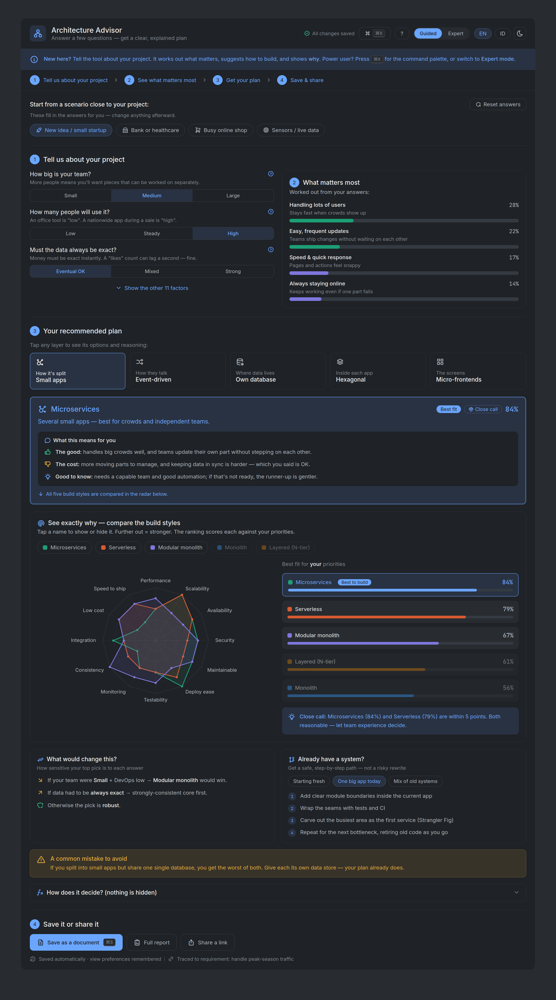

# Phase 3 — Blueprint (Design & Architecture)

> 🔬 **In progress.** Phase 3 of 7. Follows [Requirement Analysis](../02-requirement-analysis/).
>
> **Output:** the design specification + an interactive UI prototype (system architecture, module
> & data schema, design system, UX patterns, and design decisions).

## Deliverables

➡️ **[Design Specification (Blueprint)](design-specification.md)** — draft v0.4: architecture
overview, module & code structure, the decision-model data schema, state & persistence (with a
resilience & edge-case design), the design system & tokens, UX patterns, the key design decisions
(ADRs), and a Definition-of-Ready gate for development.

📊 **[Model Data Sheet](model-data-sheet.md)** — the single source of truth for every numeric
model value (12 QAs, 14 factors + defaults, factor→QA matrix, D1–D5 `qaFit`, anti-pattern rules,
calibrated preset levels), so Phase 4 development builds with no guesswork.

🧮 **[Scoring Algorithm Specification](scoring-algorithm.md)** — the exact computation contract:
every formula, tie-break, close-call/sensitivity definition, and rounding rule, with worked
fixtures that [`scripts/verify-model.mjs`](../../scripts/verify-model.mjs) re-checks automatically.

📚 **[Option Content Sheet](option-content-sheet.md)** — the bilingual (EN · ID) educational
copy for all 21 architecture options (definition, pros/cons, when to use/avoid, common mistakes,
risks + mitigations, learn-more sources), plus the anti-pattern messages and fitness-function
templates — the content that makes the tool trustworthy and teachable.

🖼️ **[UI prototype](prototype/index.html)** — the interactive visual reference. Open it directly
in any browser; what it demonstrates is described in [`prototype/README.md`](prototype/README.md).

> Note: a backend ERD and API design are **not applicable** — Architecture Advisor is purely
> client-side (see the design spec, Section 2). The "data schema" here is the in-app decision-model
> configuration, covered in Section 4 of the design spec.

Contributions to this phase are welcome — see [`../../CONTRIBUTING.md`](../../CONTRIBUTING.md).
