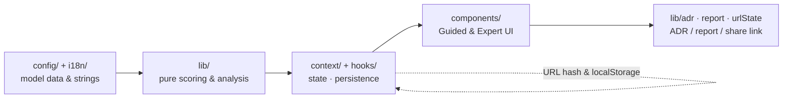

# Architecture Advisor — Design Specification (Blueprint)

**Blueprint Phase · Software Design Document**

| Field | Detail |
|---|---|
| **Document type** | Design Specification / Software Design Document (SDD) |
| **Version** | 0.1 |
| **Date** | 2026-06-11 |
| **Status** | Draft |
| **Author / Owner** | Faqih Pratama Muhti, B.Sc. Computer Science |
| **Audience** | Engineers, architects, designers |
| **Derived from** | [SRS](../02-requirement-analysis/software-requirements-specification.md) v0.1 · [Build Spec v3](../specs/build-spec-v3.md) · [Charter](../01-discovery-and-planning/discovery-and-planning.md) v1.2 · [UI prototype](prototype/index.html) |
| **License** | [CC BY 4.0](../../LICENSE-docs.md) |

**Document history**

| Version | Date | Summary |
|---|---|---|
| 0.1 | 2026-06-11 | Initial blueprint: architecture, module/data schema, design system, UX patterns, ADRs |

---

## Table of Contents

- [1. Introduction](#1-introduction)
- [2. Architecture Overview](#2-architecture-overview)
- [3. Module & Code Structure](#3-module--code-structure)
- [4. Decision-Model Data Schema](#4-decision-model-data-schema)
- [5. State Management & Persistence](#5-state-management--persistence)
- [6. Design System & Tokens](#6-design-system--tokens)
- [7. UX Patterns & Interaction](#7-ux-patterns--interaction)
- [8. Key Design Decisions (ADRs)](#8-key-design-decisions-adrs)
- [9. Traceability](#9-traceability)
- [10. Open Issues & To Be Determined](#10-open-issues--to-be-determined)

---

## 1. Introduction

This document turns the [Software Requirements Specification](../02-requirement-analysis/software-requirements-specification.md)
into a buildable design: the application's own architecture, module boundaries, the
decision-model data schema, state handling, the design system, the UX patterns, and the key
design decisions. The runnable [UI prototype](prototype/index.html) is the visual reference; this
document is its structural and data counterpart. Model internals (factor values, fit vectors,
rule conditions) remain defined by [Build Spec v3](../specs/build-spec-v3.md) and are referenced,
not duplicated.

**References:** [SRS](../02-requirement-analysis/software-requirements-specification.md) ·
[Build Spec v3](../specs/build-spec-v3.md) · [Charter](../01-discovery-and-planning/discovery-and-planning.md) ·
[UI/UX Execution Playbook](../guides/uiux-execution-playbook.md) · ISO/IEC/IEEE 42010 (architecture
description) · ISO/IEC 25010:2023.

---

## 2. Architecture Overview

Architecture Advisor is a **pure client-side single-page application**. The product is a
transparent pipeline — and so is the code: configuration data flows through a pure functional
core into the UI and back out as documents.



**Architectural properties (dogfooding the model):**

- **Deployment Granularity (D1):** a single static bundle — a **Monolith / Modular SPA**. No
  backend; appropriate for the tiny scale and top time-to-market priority.
- **Code Structure (D4):** a **layered split with a pure functional core** — all math lives in
  `lib/` and is independent of React, framework, and IO (a Hexagonal-leaning boundary). This is
  what makes the model auditable and unit-testable (NFR-MAINT-1/2).
- **Frontend Architecture (D5):** a **Monolithic SPA** (micro-frontends are unjustified at this
  scale).
- **Data Management (D3):** browser-local only — `localStorage` + URL hash; no database.

> **In plain language:** the part that does the math is kept completely separate from the part
> that draws the screen, so the numbers can be checked and tested on their own, and the whole
> thing ships as one small website with nothing to run on a server.

---

## 3. Module & Code Structure

The source layout follows [Build Spec v3 §13](../specs/build-spec-v3.md). All math is in pure,
unit-tested functions in `lib/`; every weight, fit value, rule, and string lives in `config/` or
`i18n/` — never hard-coded in components (NFR-MAINT-1).

```
src/
├── App.tsx
├── context/        AppStateContext · ThemeContext · LangContext
├── i18n/           dict.ts  (the { en, id } dictionary + t() helper)
├── config/         qualityAttributes · factors · factorQaMatrix · dimensions
│                   antiPatterns · fitnessFunctions · presets · migrationPaths
├── lib/            scoring · sensitivity · antiPatternEngine · adr · report
│                   c4 · urlState · customConfig
├── hooks/          usePersistedState · useUrlSyncedState
└── components/     Header · Disclaimer · ModeToggle · PresetBar · FactorGroup …
                    QaWeightChart · DimensionResults · RadarTradeoff · ContributionTable
                    ComparisonMode · SensitivityCard · RiskRegister · AntiPatternAlerts
                    FitnessFunctions · MigrationPath · MethodologyPanel · ReportPreview …
```

| Layer | Responsibility | Depends on | Must NOT depend on |
|---|---|---|---|
| `config/`, `i18n/` | The model as data (auditable, extensible) | — | anything |
| `lib/` | Pure scoring, sensitivity, anti-pattern engine, ADR/report/URL/C4 generation | `config/` types | React, DOM, IO |
| `context/`, `hooks/` | App state, persistence, URL sync, theme, language | `lib/`, `config/` | individual components |
| `components/` | Presentation for Guided & Expert modes | `context/`, `lib/` | — |

This dependency direction (data → pure core → state → UI) is the architectural fitness function
for the codebase: a build-time check **should** forbid `lib/` from importing React or components.

---

## 4. Decision-Model Data Schema

The `config/` datasets required by [SRS §5.2](../02-requirement-analysis/software-requirements-specification.md#5-data--decision-model-requirements)
are typed as follows (sketch; authoritative values in [Build Spec v3 §3–§11](../specs/build-spec-v3.md)).

```ts
type Bilingual = { en: string; id: string };
type QaId = 'performance' | 'scalability' | 'availability' | 'security'
  | 'maintainability' | 'deployability' | 'testability' | 'observability'
  | 'dataConsistency' | 'interoperability' | 'costEfficiency' | 'timeToMarket';

interface QualityAttribute {            // 12 of these — BS §3
  id: QaId; name: Bilingual; definition: Bilingual;
  isoMapping: string; economicFlag: boolean;        // true = outside ISO product model
}

interface Factor {                       // ≥12 — BS §4
  id: string; label: Bilingual; group: string;
  levels: [Bilingual, Bilingual, Bilingual];        // index 0..2
  help: Bilingual;
}

type FactorQaMatrix = Record<string, Partial<Record<QaId, number>>>;  // influences — BS §5

interface Risk { description: Bilingual; likelihood: Level; impact: Level; mitigation: Bilingual; }
type Level = 'Low' | 'Med' | 'High';

interface DimensionOption {              // BS §6, §7, §9
  id: string; name: string; summary: Bilingual;
  qaFit: Record<QaId, 1 | 2 | 3 | 4 | 5>;           // unlisted defaults to 3
  definition: Bilingual; pros: Bilingual[]; cons: Bilingual[];
  whenToUse: Bilingual[]; whenToAvoid: Bilingual[];
  commonMistakes: Bilingual[]; learnMore: { label: string; url: string }[];
  risks: Risk[];
}
interface Dimension { id: 'D1'|'D2'|'D3'|'D4'|'D5'; name: Bilingual; options: DimensionOption[]; }

interface AntiPatternRule {              // BS §10
  id: string; severity: 'info' | 'warning' | 'danger';
  test: (s: Assessment) => boolean; message: Bilingual;
}
type FitnessTemplate = { qa: QaId; suggestion: Bilingual };          // BS §11
interface Preset { id: string; name: Bilingual; factorLevels: Record<string, 0|1|2>; }  // BS §12
```

**Integrity rules** (SRS §5): unlisted `qaFit` → 3; normalized weights always sum to 100; a
contribution breakdown always reconciles to the composite score.

---

## 5. State Management & Persistence

React hooks only — no Redux (ADR-004). A single `AppState` is held in context and derived values
are memoized.

```ts
interface Assessment {
  factorLevels: Record<string, 0 | 1 | 2>;
  qaWeightOverrides: Partial<Record<QaId, number>>;   // Expert mode
  qaWeightLocks: Partial<Record<QaId, boolean>>;
  chosen: Partial<Record<'D1'|'D2'|'D3'|'D4'|'D5', string>>;  // selected option ids
  currentArchitecture?: string;                       // for migration path
}
interface AppState {
  assessment: Assessment;
  mode: 'guided' | 'expert'; lang: 'id' | 'en'; theme: 'light' | 'dark';
  modelVersion: string;                               // stamped into every result/export
}
```

- **Persistence:** `usePersistedState` mirrors `AppState` to `localStorage` (FR-STATE-1).
- **Shareable URL:** `useUrlSyncedState` encodes `AppState` into the URL hash (serialize → compact
  → base64), and **decodes with validation/sanitization** before use (FR-STATE-2/4, NFR-SEC-1).
- **Reproducibility:** `modelVersion` accompanies every result, export, and shared URL; on a model
  change the app offers "recompute with the latest model" (FR-STATE-3, Charter §15.2 / R8).
- **Backward compatibility:** the URL decoder tolerates older payloads (NFR-REL-2).

---

## 6. Design System & Tokens

Formalized from the [UI prototype](prototype/index.html) and UI/UX Playbook task `F0-01`.
Implemented as **CSS custom properties** themed by a class on `<html>` (Tailwind in `class` dark
mode); the prototype's `:root` / `html.light` blocks are the source of truth.

| Token group | Values |
|---|---|
| **Spacing** | 4 / 8 px grid → xs 4, sm 8, md 12, lg 16, xl 24 |
| **Radius** | md 8 · lg 12 · xl 16 |
| **Font** | Sans **Inter**; Mono **JetBrains Mono** (tabular figures for all numbers/IDs) |
| **Type scale** | ≤ 4 sizes (11/12/13–14/16) × 2 weights (400/500) |
| **Accent (dark)** | info `#6AA6FF` · success `#35C28D` · warning `#E0A93B` · danger `#EC6A60` |
| **Neutrals (dark)** | bg `#1f2226` / `#282c31` / `#343a41`; text `#ECEDEE` / `#AEB4BC` / `#7E858E` |
| **Light theme** | same token names, light values (see prototype `html.light`) |

**Component inventory:** Button · Chip · Segmented control · Badge · Card · Data grid (sortable,
sticky header, tabular numbers) · Modal / Command palette · Toast · Skeleton · Progress bar ·
Radar (recharts) · Bar chart. Every component **shall** define all states
(default/hover/active/disabled/loading/error) and meet WCAG AA contrast in both themes
(NFR-A11Y-1).

---

## 7. UX Patterns & Interaction

Derived from the [UI/UX Execution Playbook](../guides/uiux-execution-playbook.md) and realized in
the prototype.

| Pattern | Design | Requirement |
|---|---|---|
| **Guided vs Expert** | Plain-language labels & explanations vs technical terms, editable/lockable QA weights, data grid | FR-SHELL-1, FR-QA-3 |
| **4-step flow** | Factors → Priorities → Recommendation (5 dimensions) → Export, with a sticky step indicator | FR-FACT/QA/REC/OUT |
| **Perceived performance** | Optimistic updates; **skeleton** (not spinner) on recompute; transitions 150–250 ms; no layout shift | FR-UI-2/6, NFR-PERF-1 |
| **Command palette & keyboard** | `⌘/Ctrl-K` palette over all core actions; standard shortcuts (`⌘S`, `⌘Z`, `Esc`, `Enter`); full keyboard operation | FR-SHELL-8, NFR-A11Y-2 |
| **Transparency & control** | Persistent save-state; **undo** for destructive actions; reset behind confirmation | FR-UI-1/4, FR-SHELL-6 |
| **Three-layer errors** | What / why / how-to-fix + copyable request ID + retry for recoverable failures (e.g. share) | FR-UI-3 |
| **Guiding empty state** | "No plan yet" + load-sample-data action | FR-UI-5 |
| **Dual readability** | Every screen reads for experts and newcomers; permanent heuristics disclaimer | FR-SHELL-4, Charter §21 |

---

## 8. Key Design Decisions (ADRs)

These app-level decisions are recorded here; model-value changes follow the ADR process in
[Charter §14.4](../01-discovery-and-planning/discovery-and-planning.md#14-governance--contribution).

| ADR | Decision | Rationale / consequence |
|---|---|---|
| ADR-001 | **Pure functional scoring core** in `lib/`, isolated from React/IO | Auditable & unit-testable; cost: explicit data passing |
| ADR-002 | **Config-driven model** — no hard-coded weights/fit/rules/strings | Auditable & extensible; enables custom-config import/export |
| ADR-003 | **Client-side only**; state in `localStorage` + URL hash | Free hosting, no PII, shareable; cost: state-size limits in URL |
| ADR-004 | **React hooks only** (`useState`/`useReducer`/`useMemo`/`useContext`), no Redux | Right-sized for one app state; lower ceremony |
| ADR-005 | **recharts** (radar/bar) + **mermaid** (C4 stub) | Mature, declarative; must ship in `dependencies` |
| ADR-006 | **CSS custom properties + Tailwind** `class` dark mode for tokens | One token contract, two themes; matches the prototype |
| ADR-007 | **Model version separate from app SemVer** | Reproducible results across model changes (R8) |

---

## 9. Traceability

| Design section | Satisfies (SRS) |
|---|---|
| §2 Architecture overview | NFR-MAINT-1, NFR-PRIV-1, NFR-COMPAT-2 |
| §3 Module & code structure | NFR-MAINT-1/2; FR-DATA-* |
| §4 Data schema | FR-DATA-1…9 |
| §5 State & persistence | FR-STATE-1…4; NFR-REL-2, NFR-SEC-1 |
| §6 Design system | NFR-A11Y-1; FR-SHELL-3 |
| §7 UX patterns | FR-SHELL-*, FR-UI-*, FR-REC-13; NFR-PERF-1, NFR-A11Y-2 |
| §8 ADRs | NFR-MAINT-1/3; FR-STATE-3 |

---

## 10. Open Issues & To Be Determined

| # | Open issue | Notes |
|---|---|---|
| DI-1 | Final D4/D5 `qaFit` values | Inherits SRS OI-4; record as an ADR once set |
| DI-2 | Whether URL-hash state needs a compression library | Decide against a size budget (DI-4) |
| DI-3 | Final design-token values vs the prototype | Promote the prototype `:root` blocks to the token source of truth |
| DI-4 | Performance budgets (bundle size, p95 interaction) | Inherits SRS OI-5 |
| DI-5 | C4 Mermaid stub (FR-OUT-5) — in v1.0 or deferred | Inherits SRS OI-3 (Could-priority) |

---

> **In plain language:** this is the building plan. It says how the code is divided so the maths
> can be trusted, what the data looks like, how the app remembers your work and shares it, and
> what the screens and colours should be — all tied back to the requirements so the build has no
> guesswork.
