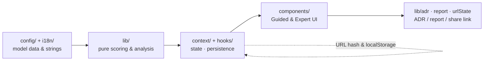

# Architecture Advisor — Design Specification (Blueprint)

**Blueprint Phase · Software Design Document**

| Field | Detail |
|---|---|
| **Document type** | Design Specification / Software Design Document (SDD) |
| **Version** | 0.8 |
| **Date** | 2026-06-16 |
| **Status** | Draft |
| **Author / Owner** | Faqih Pratama Muhti, B.Sc. Computer Science |
| **Audience** | Engineers, architects, designers |
| **Derived from** | [SRS](../02-requirement-analysis/software-requirements-specification.md) v0.9 · [Build Spec v3](../specs/build-spec-v3.md) · [Charter](../01-discovery-and-planning/discovery-and-planning.md) v1.7 · [UI prototype](prototype/index.html) |
| **License** | [CC BY 4.0](../../LICENSE-docs.md) |

**Document history**

| Version | Date | Summary |
|---|---|---|
| 0.1 | 2026-06-11 | Initial blueprint: architecture, module/data schema, design system, UX patterns, ADRs |
| 0.2 | 2026-06-12 | Realigned to SRS v0.2 / Charter v1.4: added a resilience & edge-case design (Section 5.1) covering FR-EDGE-*, browser-baseline and performance-budget coverage, corrected the design-token source reference, and extended traceability |
| 0.3 | 2026-06-12 | Build-readiness: linked the new [Model Data Sheet](model-data-sheet.md) (frozen numeric model values), added a Definition-of-Ready gate (Section 11), and updated DI-1 to the recorded baseline |
| 0.4 | 2026-06-12 | Computation precision: linked the [Scoring Algorithm Specification](scoring-algorithm.md) as the exact contract for `lib/scoring.ts`/`lib/sensitivity.ts`; Definition of Ready updated — scoring computation pinned and preset calibration machine-verified |
| 0.5 | 2026-06-13 | Definition of Ready: D4/D5 `qaFit` and preset calibration interim-ratified ([ADR-0001](../adr/0001-ratify-d4-d5-qafit.md), [ADR-0002](../adr/0002-ratify-preset-calibration.md)); DI-1 closed |
| 0.6 | 2026-06-13 | Resolved DI-5 / SRS OI-3: a basic C4 Mermaid stub is in v1.0 (richer auto-generated C4 deferred to v2.x); Definition-of-Ready C4 item checked |
| 0.7 | 2026-06-13 | Ratified the performance budgets as v1.0 targets (ADR-008, closes DI-4 / SRS OI-5), with mandatory lazy-loading of mermaid/recharts; real-bundle measurement remains a Phase 4/5 verification step |
| 0.8 | 2026-06-16 | Implementation reconciliation: ADR-005 superseded — all charts **and** the C4 stub are hand-built SVG; `recharts` and `mermaid` removed (ADR-008 note, design-system + Definition-of-Ready updated). See [DECISIONS.md](../../DECISIONS.md). No design intent changed otherwise |

---

## Table of Contents

- [1. Introduction](#1-introduction)
- [2. Architecture Overview](#2-architecture-overview)
- [3. Module & Code Structure](#3-module--code-structure)
- [4. Decision-Model Data Schema](#4-decision-model-data-schema)
- [5. State Management & Persistence](#5-state-management--persistence)
- [6. Design System & Tokens](#6-design-system--tokens)
- [7. UX Patterns & Interaction](#7-ux-patterns--interaction)
- [8. Key Design Decisions (ADRs)](#8-key-design-decisions-adrs)
- [9. Traceability](#9-traceability)
- [10. Open Issues & To Be Determined](#10-open-issues--to-be-determined)
- [11. Definition of Ready for Development](#11-definition-of-ready-for-development)

---

## 1. Introduction

This document turns the [Software Requirements Specification](../02-requirement-analysis/software-requirements-specification.md)
into a buildable design: the application's own architecture, module boundaries, the
decision-model data schema, state handling, the design system, the UX patterns, and the key
design decisions. The runnable [UI prototype](prototype/index.html) is the visual reference; this
document is its structural and data counterpart. Model internals (factor values, fit vectors,
rule conditions) remain defined by [Build Spec v3](../specs/build-spec-v3.md) and are referenced,
not duplicated.

**References:** [SRS](../02-requirement-analysis/software-requirements-specification.md) ·
[Build Spec v3](../specs/build-spec-v3.md) · [Charter](../01-discovery-and-planning/discovery-and-planning.md) ·
[UI/UX Execution Playbook](../guides/uiux-execution-playbook.md) · ISO/IEC/IEEE 42010:2022 (architecture
description) · ISO/IEC 25010:2023 · A. Cockburn, "Hexagonal Architecture" (2005) — the `lib/` port
boundary (Section 3) · R. C. Martin, *Clean Architecture* (2017) — the dependency rule (Section 3) ·
*MADR* (adr.github.io/madr) — the ADR format (Section 8).

---

## 2. Architecture Overview

Architecture Advisor is a **pure client-side single-page application**. The product is a
transparent pipeline — and so is the code: configuration data flows through a pure functional
core into the UI and back out as documents.



**Architectural properties (dogfooding the model):**

- **Deployment Granularity (D1):** a single static bundle — a **Monolith / Modular SPA**. No
  backend; appropriate for the tiny scale and top time-to-market priority.
- **Code Structure (D4):** a **layered split with a pure functional core** — all math lives in
  `lib/` and is independent of React, framework, and IO (a Hexagonal-leaning boundary). This is
  what makes the model auditable and unit-testable (NFR-MAINT-1/2).
- **Frontend Architecture (D5):** a **Monolithic SPA** (micro-frontends are unjustified at this
  scale).
- **Data Management (D3):** browser-local only — `localStorage` + URL hash; no database.

> **In plain language:** the part that does the math is kept completely separate from the part
> that draws the screen, so the numbers can be checked and tested on their own, and the whole
> thing ships as one small website with nothing to run on a server.

---

## 3. Module & Code Structure

The source layout follows [Build Spec v3 Section 13](../specs/build-spec-v3.md). All math is in pure,
unit-tested functions in `lib/`; every weight, fit value, rule, and string lives in `config/` or
`i18n/` — never hard-coded in components (NFR-MAINT-1). `lib/scoring.ts` and `lib/sensitivity.ts`
implement the [Scoring Algorithm Specification](scoring-algorithm.md) **exactly** — formulas,
tie-breaking, rounding, and fixtures are pinned there, and
[`scripts/verify-model.mjs`](../../scripts/verify-model.mjs) re-checks them against the
[Model Data Sheet](model-data-sheet.md).

```
src/
├── App.tsx
├── context/        AppStateContext · ThemeContext · LangContext
├── i18n/           dict.ts  (the { en, id } dictionary + t() helper)
├── config/         qualityAttributes · factors · factorQaMatrix · dimensions
│                   antiPatterns · fitnessFunctions · presets · migrationPaths
├── lib/            scoring · sensitivity · antiPatternEngine · adr · report
│                   c4 · urlState · customConfig
├── hooks/          usePersistedState · useUrlSyncedState
└── components/     Header · Disclaimer · ModeToggle · PresetBar · FactorGroup …
                    QaWeightChart · DimensionResults · RadarTradeoff · ContributionTable
                    ComparisonMode · SensitivityCard · RiskRegister · AntiPatternAlerts
                    FitnessFunctions · MigrationPath · MethodologyPanel · ReportPreview …
```

| Layer | Responsibility | Depends on | Must NOT depend on |
|---|---|---|---|
| `config/`, `i18n/` | The model as data (auditable, extensible) | — | anything |
| `lib/` | Pure scoring, sensitivity, anti-pattern engine, ADR/report/URL/C4 generation | `config/` types | React, DOM, IO |
| `context/`, `hooks/` | App state, persistence, URL sync, theme, language | `lib/`, `config/` | individual components |
| `components/` | Presentation for Guided & Expert modes | `context/`, `lib/` | — |

This dependency direction (data → pure core → state → UI) is the architectural fitness function
for the codebase: a build-time check **should** forbid `lib/` from importing React or components.

---

## 4. Decision-Model Data Schema

The `config/` datasets required by [SRS Section 5.2](../02-requirement-analysis/software-requirements-specification.md#5-data--decision-model-requirements)
are typed as follows (sketch). **Every concrete value the engine needs is frozen in the
[Model Data Sheet](model-data-sheet.md)** — the 12-QA index, the 14 factors + defaults, the
factor→QA matrix, all D1–D5 `qaFit` vectors, the anti-pattern rules, and the preset levels — so the
`config/` files have a single, unambiguous source to mirror.

```ts
type Bilingual = { en: string; id: string };
type QaId = 'performance' | 'scalability' | 'availability' | 'security'
  | 'maintainability' | 'deployability' | 'testability' | 'observability'
  | 'dataConsistency' | 'interoperability' | 'costEfficiency' | 'timeToMarket';

interface QualityAttribute {            // 12 of these — Build Spec Section 3
  id: QaId; name: Bilingual; definition: Bilingual;
  isoMapping: string; economicFlag: boolean;        // true = outside ISO product model
}

interface Factor {                       // 14 — Build Spec Section 4 / Model Data Sheet Section 2
  id: string; label: Bilingual; group: string;
  levels: [Bilingual, Bilingual, Bilingual];        // index 0..2
  help: Bilingual;
}

type FactorQaMatrix = Record<string, Partial<Record<QaId, number>>>;  // influences — Build Spec Section 5

interface Risk { description: Bilingual; likelihood: Level; impact: Level; mitigation: Bilingual; }
type Level = 'Low' | 'Med' | 'High';

interface DimensionOption {              // Build Spec Section 6, Section 7, Section 9
  id: string; name: string; summary: Bilingual;
  qaFit: Record<QaId, 1 | 2 | 3 | 4 | 5>;           // unlisted defaults to 3
  definition: Bilingual; pros: Bilingual[]; cons: Bilingual[];
  whenToUse: Bilingual[]; whenToAvoid: Bilingual[];
  commonMistakes: Bilingual[]; learnMore: { label: string; url: string }[];
  risks: Risk[];
}
interface Dimension { id: 'D1'|'D2'|'D3'|'D4'|'D5'; name: Bilingual; options: DimensionOption[]; }

interface AntiPatternRule {              // Build Spec Section 10
  id: string; severity: 'info' | 'warning' | 'danger';
  test: (s: Assessment) => boolean; message: Bilingual;
}
type FitnessTemplate = { qa: QaId; suggestion: Bilingual };          // Build Spec Section 11
interface Preset { id: string; name: Bilingual; factorLevels: Record<string, 0|1|2>; }  // Build Spec Section 12
```

**Integrity rules** (SRS Section 5): unlisted `qaFit` → 3; normalized weights always sum to 100; a
contribution breakdown always reconciles to the composite score.

---

## 5. State Management & Persistence

React hooks only — no Redux (ADR-004). A single `AppState` is held in context and derived values
are memoized.

```ts
interface Assessment {
  factorLevels: Record<string, 0 | 1 | 2>;
  qaWeightOverrides: Partial<Record<QaId, number>>;   // Expert mode
  qaWeightLocks: Partial<Record<QaId, boolean>>;
  chosen: Partial<Record<'D1'|'D2'|'D3'|'D4'|'D5', string>>;  // selected option ids
  currentArchitecture?: string;                       // for migration path
}
interface AppState {
  assessment: Assessment;
  mode: 'guided' | 'expert'; lang: 'id' | 'en'; theme: 'light' | 'dark';
  modelVersion: string;                               // stamped into every result/export
}
```

- **Persistence:** `usePersistedState` mirrors `AppState` to `localStorage` (FR-STATE-1).
- **Shareable URL:** `useUrlSyncedState` encodes `AppState` into the URL hash (serialize → compact
  → base64), and **decodes with validation/sanitization** before use (FR-STATE-2/4, NFR-SEC-1).
- **Reproducibility:** `modelVersion` accompanies every result, export, and shared URL; on a model
  change the app offers "recompute with the latest model" (FR-STATE-3, Charter Section 15.2 / R8).
- **Backward compatibility:** the URL decoder tolerates older payloads (NFR-REL-2).

### 5.1 Resilience & edge-case handling

How the design satisfies the SRS edge-case requirements (FR-EDGE-\*), so failure modes are built
in rather than discovered later:

| SRS requirement | Design response |
|---|---|
| FR-EDGE-1 — bad shared URL | `useUrlSyncedState` decode is **total**: a parse/schema/checksum failure returns a typed `Err`, the app falls back to the `localStorage` state (or defaults), and a non-blocking toast is shown. Decode never throws to the render tree. |
| FR-EDGE-2 — `localStorage` unavailable | `usePersistedState` probes storage once; on failure it switches to an in-memory store for the session and surfaces a persistent "changes won't be saved" notice — the app stays fully usable. |
| FR-EDGE-3 — invalid config import | `lib/customConfig.ts` validates an imported JSON against the schema (Section 4); on any failure it returns a typed error naming the offending field and leaves the active config untouched. |
| FR-EDGE-4 — unsupported browser | A small bootstrap feature-detects ES2020 + `localStorage`; if absent it renders a static, readable plain-HTML message instead of mounting the SPA. |
| FR-EDGE-5 — older model version | The decoded payload's `modelVersion` is compared to the current one; on mismatch the result renders as-is and a "recompute with the current model" action is offered (never a silent rescore). |
| FR-EDGE-6 — total scoring | `lib/scoring.ts` clamps factor levels to 0–2, defaults unlisted `qaFit` to 3, and when all normalized weights resolve to 0 falls back to equal weights — so a composite score is defined for every input. |
| FR-EDGE-7 — deterministic outputs | `lib/adr.ts` / `report.ts` take an explicit clock and locale; timestamps are emitted in UTC ISO-8601 so identical state yields byte-identical exports. |

These behaviors are unit-tested in `lib/` (pure) and at the hook boundary, satisfying NFR-MAINT-2.

---

## 6. Design System & Tokens

Formalized from the [UI prototype](prototype/index.html) and [UI/UX Playbook](../guides/uiux-execution-playbook.md) Task 0.2 (Design System / Design Tokens).
Implemented as **CSS custom properties** themed by a class on `<html>` (Tailwind in `class` dark
mode); the prototype's `:root` / `html.light` blocks are the source of truth.

| Token group | Values |
|---|---|
| **Spacing** | 4 / 8 px grid → xs 4, sm 8, md 12, lg 16, xl 24 |
| **Radius** | md 8 · lg 12 · xl 16 |
| **Font** | Sans **Inter**; Mono **JetBrains Mono** (tabular figures for all numbers/IDs) |
| **Type scale** | ≤ 4 sizes (11/12/13–14/16) × 2 weights (400/500) |
| **Accent (dark)** | info `#6AA6FF` · success `#35C28D` · warning `#E0A93B` · danger `#EC6A60` |
| **Neutrals (dark)** | bg `#1f2226` / `#282c31` / `#343a41`; text `#ECEDEE` / `#AEB4BC` / `#7E858E` |
| **Light theme** | same token names, light values (see prototype `html.light`) |

**Component inventory:** Button · Chip · Segmented control · Badge · Card · Data grid (sortable,
sticky header, tabular numbers) · Modal / Command palette · Toast · Skeleton · Progress bar ·
Radar · bar chart (hand-built SVG). Every component **shall** define all states
(default/hover/active/disabled/loading/error) and meet WCAG AA contrast in both themes
(NFR-A11Y-1).

---

## 7. UX Patterns & Interaction

Derived from the [UI/UX Execution Playbook](../guides/uiux-execution-playbook.md) and realized in
the prototype.

| Pattern | Design | Requirement |
|---|---|---|
| **Guided vs Expert** | Plain-language labels & explanations vs technical terms, editable/lockable QA weights, data grid | FR-SHELL-1, FR-QA-3 |
| **4-step flow** | Factors → Priorities → Recommendation (5 dimensions) → Export, with a sticky step indicator | FR-FACT/QA/REC/OUT |
| **Perceived performance** | Optimistic updates; **skeleton** (not spinner) on recompute; transitions 150–250 ms; no layout shift | FR-UI-2/6, NFR-PERF-1 |
| **Command palette & keyboard** | `⌘/Ctrl-K` palette over all core actions; standard shortcuts (`⌘S`, `⌘Z`, `Esc`, `Enter`); full keyboard operation | FR-SHELL-8, NFR-A11Y-2 |
| **Transparency & control** | Persistent save-state; **undo** for destructive actions; reset behind confirmation | FR-UI-1/4, FR-SHELL-6 |
| **Three-layer errors** | What / why / how-to-fix + copyable request ID + retry for recoverable failures (e.g. share) | FR-UI-3 |
| **Guiding empty state** | "No plan yet" + load-sample-data action | FR-UI-5 |
| **Dual readability** | Every screen reads for experts and newcomers; permanent heuristics disclaimer | FR-SHELL-4, Charter Section 21 |

---

## 8. Key Design Decisions (ADRs)

These app-level decisions are recorded here; model-value changes follow the ADR process in
[Charter Section 14.4](../01-discovery-and-planning/discovery-and-planning.md#14-governance--contribution).

| ADR | Decision | Rationale / consequence |
|---|---|---|
| ADR-001 | **Pure functional scoring core** in `lib/`, isolated from React/IO | Auditable & unit-testable; cost: explicit data passing |
| ADR-002 | **Config-driven model** — no hard-coded weights/fit/rules/strings | Auditable & extensible; enables custom-config import/export |
| ADR-003 | **Client-side only**; state in `localStorage` + URL hash | Free hosting, no PII, shareable; cost: state-size limits in URL |
| ADR-004 | **React hooks only** (`useState`/`useReducer`/`useMemo`/`useContext`), no Redux | Right-sized for one app state; lower ceremony |
| ADR-005 | **Hand-built SVG** for charts (radar/bar) and the C4 stub | No chart/diagram library — deterministic, theme-aware, tiny. *(Superseded the original recharts + mermaid choice during implementation; see [DECISIONS.md](../../DECISIONS.md).)* |
| ADR-006 | **CSS custom properties + Tailwind** `class` dark mode for tokens | One token contract, two themes; matches the prototype |
| ADR-007 | **Model version separate from app SemVer** | Reproducible results across model changes (R8) |
| ADR-008 | **Performance budgets** as v1.0 targets — initial JS ≤ 300 KB gzip, FCP ≤ 2 s (fast-3G), re-score p95 ≤ 100 ms | Grounded in the 100 ms response limit [Miller/Nielsen] and Core-Web-Vitals FCP guidance. **Implementation:** all visuals are hand-built SVG (no chart/diagram library), so no heavy chunk needs lazy-loading (see [DECISIONS.md](../../DECISIONS.md)). Verified by a CI bundle-size gate + Lighthouse in Phase 4/5 |

---

## 9. Traceability

| Design section | Satisfies (SRS) |
|---|---|
| Section 2 Architecture overview | NFR-MAINT-1, NFR-PRIV-1, NFR-COMPAT-1/2, NFR-PERF-3 |
| Section 3 Module & code structure | NFR-MAINT-1/2; FR-DATA-* |
| Section 4 Data schema | FR-DATA-1…9 |
| Section 5 State & persistence | FR-STATE-1…4; NFR-REL-2, NFR-SEC-1 |
| Section 5.1 Resilience & edge cases | FR-EDGE-1…7 |
| [Scoring Algorithm Specification](scoring-algorithm.md) (companion) | FR-QA-1, FR-QA-3, FR-REC-2/4/6/7, FR-EDGE-6/7 |
| Section 6 Design system | NFR-A11Y-1; FR-SHELL-3 |
| Section 7 UX patterns | FR-SHELL-*, FR-UI-*, FR-REC-13; NFR-PERF-1, NFR-A11Y-2 |
| Section 8 ADRs | NFR-MAINT-1/3; FR-STATE-3 |

---

## 10. Open Issues & To Be Determined

| # | Open issue | Notes |
|---|---|---|
| DI-1 | ~~Ratify D4/D5 `qaFit` values~~ — **Done (interim)** | [ADR-0001](../adr/0001-ratify-d4-d5-qafit.md) accepts the [Model Data Sheet](model-data-sheet.md) Section 4 baseline; closes SRS OI-4 |
| DI-2 | Whether URL-hash state needs a compression library | Decide against a size budget (DI-4) |
| DI-3 | Final design-token values vs the prototype | Promote the prototype `:root` blocks to the token source of truth |
| DI-4 | ~~Ratify the performance budgets~~ — **Targets ratified** ([ADR-008](#8-key-design-decisions-adrs)) | Numbers committed as v1.0 budgets (SRS OI-5 closed); the real-bundle measurement is a Phase 4/5 verification step (CI bundle gate + Lighthouse) |
| DI-5 | ~~C4 Mermaid stub — in v1.0 or deferred~~ — **Resolved** | In v1.0 as a basic stub (FR-OUT-5, Could; SRS OI-3 closed); richer auto-generated C4 deferred to v2.x |

---

## 11. Definition of Ready for Development

Phase 4 (development) may begin once every item below holds. This is the gate that keeps the build
free of guesswork — each line is either fixed or has a usable baseline.

- [x] All **numeric model values frozen** in the [Model Data Sheet](model-data-sheet.md) — QAs, 14 factors + defaults, factor→QA matrix, D1–D5 `qaFit`, anti-pattern rules, preset levels.
- [x] **Architecture, module boundaries, data schema, and state model** fixed (Sections 2–5, incl. the resilience design 5.1).
- [x] **Design tokens** fixed against the prototype (Section 6).
- [x] **Acceptance criteria** enumerated and ready to wire as tests (SRS Section 7, AC-1…12).
- [x] **Scoring computation pinned**: formulas, tie-breaking, close-call, sensitivity, rounding, and float-precision rules in the [Scoring Algorithm Specification](scoring-algorithm.md), with machine-verified fixtures (`node scripts/verify-model.mjs`).
- [x] **Preset levels pass the calibration test** against SRS 5.3 — all 25 targets machine-verified, **interim-ratified** ([ADR-0002](../adr/0002-ratify-preset-calibration.md), closes SRS OI-2).
- [x] **D4/D5 `qaFit` interim-ratified** by the Owner ([ADR-0001](../adr/0001-ratify-d4-d5-qafit.md), closes SRS OI-4); an independent Domain Advisor / the v3.0 study may still revise the values.
- [x] **Factor content authored (EN/ID)**: labels, level labels, and help for all 14 factors — [Model Data Sheet Section 2.1](model-data-sheet.md) (Translator review pending).
- [x] **Option & message content authored (EN/ID)**: educational metadata for all 21 options, the 7 anti-pattern messages, and the 12 fitness-function templates — [Option Content Sheet](option-content-sheet.md) (Translator & Domain-Advisor review pending).
- [x] **C4 stub** scoped: in v1.0 as a basic diagram stub (hand-built SVG; FR-OUT-5, Could); richer auto-generated C4 deferred to v2.x (SRS OI-3 closed).
- [x] **Performance budget targets ratified** ([ADR-008](#8-key-design-decisions-adrs); SRS OI-5 closed) — committed as v1.0 budgets; in implementation all visuals are hand-built SVG (no chart/diagram libraries). *Measuring the real production bundle against them is the one remaining item, inherently a Phase 4/5 verification step (CI bundle gate + Lighthouse).*

Checked items are done. The unchecked items all have **baseline values recorded in the Model Data
Sheet**, so development is unblocked today — closing them refines numbers, never the structure.

---

> **In plain language:** this is the building plan. It says how the code is divided so the maths
> can be trusted, what the data looks like, how the app remembers your work and shares it, and
> what the screens and colours should be — all tied back to the requirements so the build has no
> guesswork.
