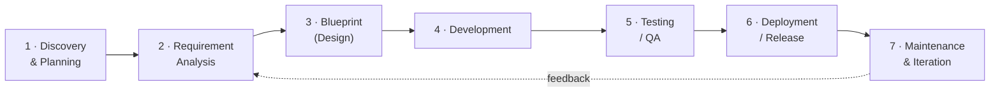

# Documentation Map

This directory documents Architecture Advisor across the **software development lifecycle
(SDLC)**, so the flow of work is explicit and traceable from idea to maintenance. All
documentation is written in English; the product itself targets both Indonesian and English.

## Development lifecycle

Each phase lives in its own numbered folder, and each produces a concrete deliverable:

| # | Phase | Folder | Key output | Status |
|---|-------|--------|-----------|--------|
| 1 | Discovery & Planning | [`01-discovery-and-planning/`](01-discovery-and-planning/discovery-and-planning.md) | Project charter / product vision | ✅ Complete |
| 2 | Requirement Analysis | [`02-requirement-analysis/`](02-requirement-analysis/) | [SRS](02-requirement-analysis/software-requirements-specification.md) (functional + non-functional) | 🔬 In progress — draft |
| 3 | Blueprint (Design) | [`03-blueprint/`](03-blueprint/) | [Design spec](03-blueprint/design-specification.md) + the model docs ([data sheet](03-blueprint/model-data-sheet.md), [scoring algorithm](03-blueprint/scoring-algorithm.md), [formulation](03-blueprint/model-formulation.md), [option content](03-blueprint/option-content-sheet.md)) + [UI prototype](03-blueprint/prototype/index.html) | 🔬 In progress |
| 4 | Development | [`04-development/`](04-development/) | Source code ([`src/`](../src/), scoring engine, components) | ✅ v1.0 implemented |
| 5 | Testing / QA | [`05-testing-qa/`](05-testing-qa/) | [Test plan](05-testing-qa/test-plan.md) — 62 Vitest + Playwright E2E + 3 guards; CI gates size/audit; 14/16 AC automated | 🔬 In progress |
| 6 | Deployment / Release | [`06-deployment/`](06-deployment/) | [Live on GitHub Pages](https://programmershinobi.github.io/architecture-advisor/) via `deploy.yml` | ✅ Live |
| 7 | Maintenance & Iteration | [`07-maintenance/`](07-maintenance/) | Monitoring, fixes, updates, changelog | 🚧 Not started (post-launch) |

## Cross-cutting references

**Placement rule:** a document tied to **one** phase lives in that phase's folder (e.g. the
[deployment guide](06-deployment/deployment-github-pages.md) in `06-deployment/`); only documents
spanning **multiple** phases live here:

| Folder | Document | Summary |
|--------|----------|---------|
| [`specs/`](specs/) | [Build Spec v3](specs/build-spec-v3.md) | The complete technical specification the app is built from (feeds phases 2–5) |
| [`guides/`](guides/) | [UI/UX Execution Playbook](guides/uiux-execution-playbook.md) | 9 usability factors for technical users as executable tasks (phases 3–4) |
| [`guides/`](guides/) | [Feature-Maturity Playbook](guides/feature-maturity-playbook.md) | UX/technical/analyst factors as concrete, verifiable tasks (phases 4–7) |
| [`adr/`](adr/) | [Architecture Decision Records](adr/) | The model-decision log (e.g. the D4/D5 fit & preset ratifications), per charter governance |

## Reading paths

- **Quick overview** → [Discovery charter](01-discovery-and-planning/discovery-and-planning.md), Preface + Section 1, Section 3.
- **Build the app** → [Build Spec v3](specs/build-spec-v3.md) + [Model Data Sheet](03-blueprint/model-data-sheet.md) + [Scoring Algorithm](03-blueprint/scoring-algorithm.md) (verify with `node scripts/verify-model.mjs`) + [Option Content Sheet](03-blueprint/option-content-sheet.md) for the bilingual UI copy, then the [deployment guide](06-deployment/deployment-github-pages.md).
- **Audit or challenge the model** → [Formal Model Formulation](03-blueprint/model-formulation.md) (the math + the decision-analysis literature) and [Scoring Algorithm Section 11](03-blueprint/scoring-algorithm.md) (validity & limitations).
- **Polish the UX** → the two playbooks in [`guides/`](guides/).
- **Contribute** → [`../CONTRIBUTING.md`](../CONTRIBUTING.md) and Section 14 of the discovery charter.
